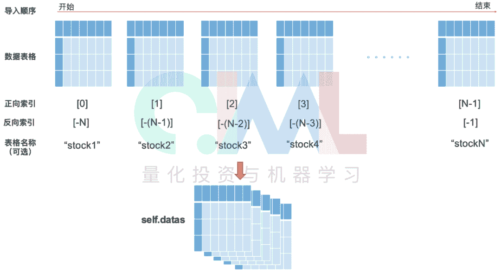
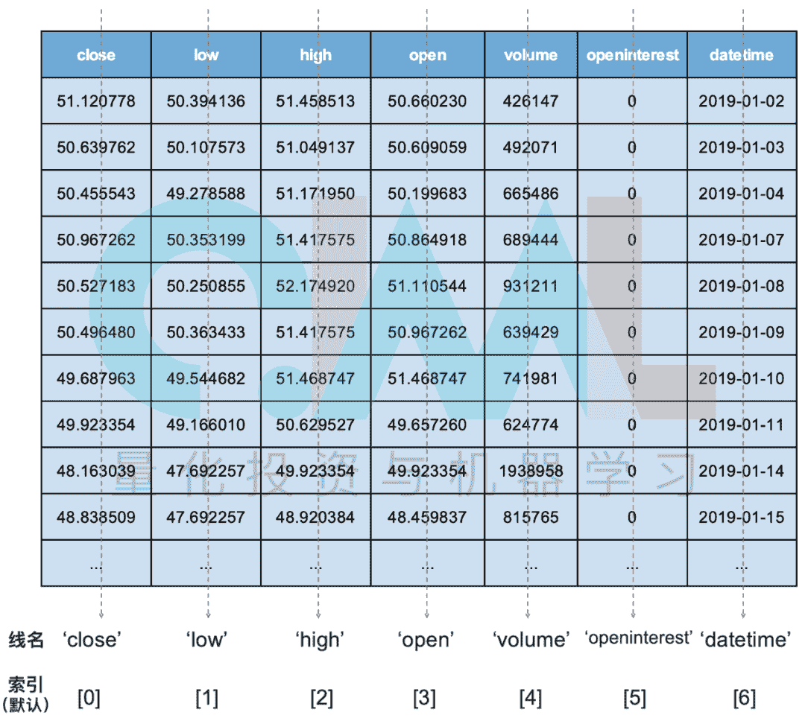
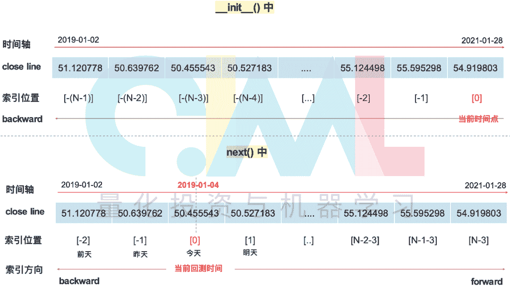
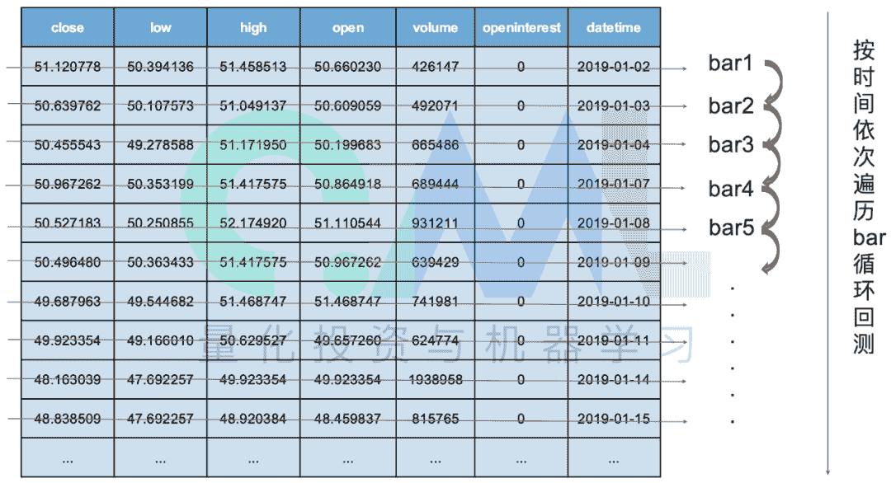

<!--yml
category: 交易
date: 2023-09-17 19:50:03
-->

# Backtrader系列教程②:数据篇

> 来源：[https://blog.csdn.net/qq_41578115/article/details/122529156](https://blog.csdn.net/qq_41578115/article/details/122529156)

# 

**前言**

阅读完上一篇Backtrader 来了后，不知大家心里是否有如下疑惑：

1、为什么用 DataFeeds 模块导入DataFrame 数据框必须依次包含7个字段 'datetime'、 'open'、'high'、'low'、'close'、'volume'、'openinterest'？

2、能否以及如何自定义导入的数据集结构？

3、为什么 self.datas[0].datetime.date(0) 返回的就是当前回测时刻？

4、self.datas 的结构是怎样的？

5、Backtrader 的数据组织形式又是怎样的？

6、回测过程中，数据的传递规则是怎样的？

7、在编写策略时，该如何提取想用的数据？

......

对上述问题进行标准化，其实就是一个传统的“数据表格创建和增删改查“问题。之所以有上述疑惑，是因为不了解 Backtrader 框架下的数据表格的属性和操作规则，下面就带大家全面深入的了解一下 ~

**Data Feed 数据馈送对象**

Backtrader 中有一个“Data Feed” 或 “Data Feeds” 概念（可将其称为“数据馈送对象” ），其实这个“Data Feed” 或 “Data Feeds”就是我们熟悉的数据表格或数据表格集合 。Data Feed 在 Backtrader 中扮演一个“数据传递者”的角色，给策略有序的提供数据以及数据的索引位置 。

***self.datas ***

大家在策略函数中经常用到的 self.datas 属性就是一个 Data Feeds，对应通过 Cerebro 导入的行情数据表格的集合（可能只导入了一只证券的行情数据，也可能导入了 N 只证券的行情数据）。在这个集合中，数据表格是按照导入的顺序依次确定索引位置，第一个导入的数据表格的索引位置为 0 ，之后的依次递增，如下图所示：



# 

在编写策略时，可通过索引位置从 self.datas 中调用行情数据，而且 Backtrader 的索引方式非常灵活，支持各种缩写形式：

1、2种索引方式：

a. 带中括号的常规方式 → self.datas[X]；

b. 不带中括号的缩写方式 → self.dataX（data后面没有 s），其中 X 对应索引位置编号  0,1,2,3,...,N；

2、使用负向索引位置编号 -1,-2,-3,...,-N 调用数据时，不支持缩写，必须带中括号[ ]，如 self.datas[-1]；

3、默认情况下，Backtrader 指向的是 self.datas 中的第一个导入的数据集，所以该数据集的调用方式可以直接省略索引号，写法能最简洁，有 3 种等价形式：self.datas[0] ↔ self.data0 ↔ self.data；

4、通过表格名称调用数据：self.getdatabyname('stockN')，表格名称是在导入数据时通过 name 参数设置的。

```
class TestStrategy(bt.Strategy):
    def __init__(self):
        # 打印数据集和数据集对应的名称
        print("-------------self.datas-------------")
        print(self.datas)
        print("-------------self.data-------------")
        print(self.data._name, self.data) # 返回第一个导入的数据表格，缩写形式
        print("-------------self.data0-------------")
        print(self.data0._name, self.data0) # 返回第一个导入的数据表格，缩写形式
        print("-------------self.datas[0]-------------")
        print(self.datas[0]._name, self.datas[0]) # 返回第一个导入的数据表格，常规形式
        print("-------------self.datas[1]-------------")
        print(self.datas[1]._name, self.datas[1]) # 返回第二个导入的数据表格，常规形式
        print("-------------self.datas[-1]-------------")
        print(self.datas[-1]._name, self.datas[-1]) # 返回最后一个导入的数据表格
        print("-------------self.datas[-2]-------------")
        print(self.datas[-2]._name, self.datas[-2]) # 返回倒数第二个导入的数据表格

cerebro = bt.Cerebro()
st_date = datetime.datetime(2019,1,2)
ed_date = datetime.datetime(2021,1,28)
# 添加 600466.SH 的行情数据
datafeed1 = bt.feeds.PandasData(dataname=data1,
                                fromdate=st_date,
                                todate=ed_date)
cerebro.adddata(datafeed1, name='600466.SH')
# 添加 603228.SH 的行情数据
datafeed2 = bt.feeds.PandasData(dataname=data2,
                                fromdate=st_date,
                                todate=ed_date)
cerebro.adddata(datafeed2, name='603228.SH')
cerebro.addstrategy(TestStrategy)
rasult = cerebro.run()

-------------self.datas-------------
[<backtrader.feeds.pandafeed.PandasData object at 0x7f65f2a9c2b0>, <backtrader.feeds.pandafeed.PandasData object at 0x7f65f2a9c8b0>]
-------------self.data-------------
600466.SH <backtrader.feeds.pandafeed.PandasData object at 0x7f65f2a9c2b0>
-------------self.data0-------------
600466.SH <backtrader.feeds.pandafeed.PandasData object at 0x7f65f2a9c2b0>
-------------self.datas[0]-------------
600466.SH <backtrader.feeds.pandafeed.PandasData object at 0x7f65f2a9c2b0>
-------------self.datas[1]-------------
603228.SH <backtrader.feeds.pandafeed.PandasData object at 0x7f65f2a9c8b0>
-------------self.datas[-1]-------------
603228.SH <backtrader.feeds.pandafeed.PandasData object at 0x7f65f2a9c8b0>
-------------self.datas[-2]-------------
600466.SH <backtrader.feeds.pandafeed.PandasData object at 0x7f65f2a9c2b0>
```

# 

返回的结果也再次证明，self.datas 是数据表格的集合（是一个 Data Feeds 数据馈送对象 ）， self.datas[X] 索引后返回的对象是单个的数据表格（也是一个 Data Feed 数据馈送对象），它们都是数据的传递者。

**无处不在**

除了上面提到的 self.datas 属性以及对其索引后返回的对象属于 Data Feed 外，Backtrader 中到处都是 Data Feed， Data Feed 在 Backtrader 中无处不在。只要某个属性或对象指向的是数据集，那它就属于 Data Feed，能给我们提供数据。比如 Indicators 计算指标时返回的对象、添加 Operations 观测器后返回的各类策略评价指标对象等，而且 Data Feed 对象之间运算后返回的对象也仍然属于 Data Feed，只不过这些 Data Feed 相比 self.datas 颗粒度要更细些。

**数据表格中的“行”和“列”**

了解了数据表格在 Backtrader 中扮演的“Data Feed”角色后，我们再深入到表格内部，看看 Backtrader 又给其赋予了哪些新的概念或属性。

**列是“lines”**

Backtrader 将数据表格的列拆成了一个个 line 线对象，一列→一个指标→该指标的时间序列→一条线 line。Backtrader 默认情况下要求导入的数据表格要包含 7 个字段：'datetime'、 'open'、 'high'、 'low'、 'close'、 'volume'、 'openinterest' ，这 7 个字段序列就对应了 7 条 line 。其实给列赋予“线”的概念也很好理解，回测过程中用到的时间序列行情数据可视化后就是一条条曲线：close 曲线、 open 曲线、high 曲线 ......

**如何调用某一条 line ?**

因为可以将 Data Feed 对象看做是数据表格，而表格中又包含列，所以每一个 Data Feed 对象都有一个 lines 属性。可以将 lines 属性看作是 line 的集合，所以想要调用具体的某一条线，就通过 lines 属性来调用：

1、访问 lines 属性：xxx.lines，可简写成 xxx.l；

2、访问 lines 属性 中具体某条线：xxx.lines.name，可简写成 xxx.lines_name，其中 name 对应线的名称 ;

3、一般可以套用“先调用某张数据表格，再调用这张表格中具体的某根 line”的逻辑依次编写代码；

4、可以通过 getlinealiases() 方法查看 Data Feed 对象包含哪些线。



 以 self.datas 为例，调用语句可以写成如下形式：

```
# 访问第一个数据集的 close 线
self.data.lines.close # 可省略 lines 简写成：self.data.close
self.data.lines_close # 可省略 lines 简写成：self.data_close
# 访问第二个数据集的 open 线
self.data1.lines.close # 可省略 lines 简写成：self.data1.close
self.data1.lines_close # 可省略 lines 简写成：self.data1_close
# 注：只有从 self.datas 调用 line 时可以省略 lines，调用 indicators 中的 line 时不能省略
```

# 

如果你能清楚的记住数据表格中每条线的位置，也可以通过索引位置（整数）来访问，同样支持简写形式：

1、完整形式：self.datas[X].lines[Y]；

2、简写形式：self.dataX.lines[Y]、self.dataX_Y；

3、说明：X 对应单个数据表格在数据表格集合中的索引位置，Y 对应某条线在数据表格中的索引位置 。

下面的代码给大家打印了 line 对象，并且对 line 的索引位置做了验证：

```
class TestStrategy(bt.Strategy):

    def __init__(self):
        print("--------- 打印 self 策略本身的 lines ----------")
        print(self.lines.getlinealiases())
        print("--------- 打印 self.datas 第一个数据表格的 lines ----------")
        print(self.datas[0].lines.getlinealiases())
        # 计算第一个数据集的s收盘价的20日均线，返回一个 Data feed
        self.sma = bt.indicators.SimpleMovingAverage(self.datas[0].close, period=20)
        print("--------- 打印 indicators 对象的 lines ----------")
        print(self.sma.lines.getlinealiases())
        print("---------- 直接打印 indicators 对象的所有 lines -------------")
        print(self.sma.lines)
        print("---------- 直接打印 indicators 对象的第一条 lines -------------")
        print(self.sma.lines[0])

    def next(self):
        print('验证索引位置为 6 的线是不是 datetime')
        print(bt.num2date(self.datas[0].lines[6][0]))
        # num2date() 作用是将数字形式的时间转为 date 形式

cerebro = bt.Cerebro()
st_date = datetime.datetime(2019,1,2)
ed_date = datetime.datetime(2021,1,28)
datafeed1 = bt.feeds.PandasData(dataname=data1,
                                fromdate=st_date,
                                todate=ed_date)
cerebro.adddata(datafeed1, name='600466.SH')
datafeed2 = bt.feeds.PandasData(dataname=data2,
                                fromdate=st_date,
                                todate=ed_date)
cerebro.adddata(datafeed2, name='603228.SH')
cerebro.addstrategy(TestStrategy)
rasult = cerebro.run()

--------- 打印 self 策略本身的 lines ----------
('datetime',)
--------- 打印 self.datas 第一个数据表格的 lines ----------
('close', 'low', 'high', 'open', 'volume', 'openinterest', 'datetime')
--------- 打印 indicators 对象的 lines ----------
('sma',)
---------- 直接打印 indicators 对象的所有 lines -------------
<backtrader.lineseries.Lines_LineSeries_LineIterator_DataAccessor_IndicatorBase_Indicator_MovingAverageBase_MovingAverageSimple_SimpleMovingAverage object at 0x7fa883e4a470>
---------- 直接打印 indicators 对象的第一条 lines -------------
<backtrader.linebuffer.LineBuffer object at 0x7fa883e4a2b0>
验证索引位置为 6 的线是不是 datetime
2019-01-29 00:00:00
验证索引位置为 6 的线是不是 datetime
2019-01-30 00:00:00
验证索引位置为 6 的线是不是 datetime
2019-01-31 00:00:00
验证索引位置为 6 的线是不是 datetime
2019-02-01 00:00:00
验证索引位置为 6 的线是不是 datetime
2019-02-11 00:00:00
......
```

# 

**如何提取 line 上的数据点？**

Data Feeds 、lines 、line 都可以看作是带有元素索引位置的序列，只不过序列中元素的级别不一样：Data Feeds 序列中的元素是一张张数据表格、lines 序列中的元素是一条条 line、line 序列中的元素是一个个数据点，所以对于 line 上数据点的提取方式也是类似的：通过索引位置来提取数据点。不过 Backtrader 创建了一套新的索引规则和一个切片方法 get()：

**1、索引规则**：索引位置编号结合了时间信息，0 号位置永远指向当前时间点的数据，-1 号位置指向前一个时间点的数据，然后依次回退 （backwards）-2、-3、-4、-5、......；1 号位置指向下一天的数据，然后依次向前（forwards）2、3、4、......；

**2、切片方法**：get(ago=0, size=1) 函数，其中 ago 对应数据点的索引位置，即从 ago 时间点开始往前取 size 个数据点。默认情况下是取当前最新时点（ago=0）的那一个数据（size=1）；

3、在编写策略时，上面提到的对数据点的索引切片操作一般在 next() 函数中涉及较多，而 __init__() 中涉及较少，因为__init__() 中一般是对 一整条 line 进行操作（运算）。



 具体到实际应用过程中：

```
class TestStrategy(bt.Strategy):
    def __init__(self):
        self.count = 0 # 用于计算 next 的循环次数
        # 打印数据集和数据集对应的名称
        print("------------- init 中的索引位置-------------")
        print("0 索引：",'datetime',self.data1.lines.datetime.date(0), 'close',self.data1.lines.close[0])
        print("-1 索引：",'datetime',self.data1.lines.datetime.date(-1),'close', self.data1.lines.close[-1])
        print("-2 索引",'datetime', self.data1.lines.datetime.date(-2),'close', self.data1.lines.close[-2])
        print("1 索引：",'datetime',self.data1.lines.datetime.date(1),'close', self.data1.lines.close[1])
        print("2 索引",'datetime', self.data1.lines.datetime.date(2),'close', self.data1.lines.close[2])
        print("从 0 开始往前取3天的收盘价：", self.data1.lines.close.get(ago=0, size=3))
        print("从-1开始往前取3天的收盘价：", self.data1.lines.close.get(ago=-1, size=3))
        print("从-2开始往前取3天的收盘价：", self.data1.lines.close.get(ago=-2, size=3))
        print("line的总长度：", self.data1.buflen())

    def next(self):
        print(f"------------- next 的第{self.count+1}次循环 --------------")
        print("当前时点（今日）：",'datetime',self.data1.lines.datetime.date(0),'close', self.data1.lines.close[0])
        print("往前推1天（昨日）：",'datetime',self.data1.lines.datetime.date(-1),'close', self.data1.lines.close[-1])
        print("往前推2天（前日）", 'datetime',self.data1.lines.datetime.date(-2),'close', self.data1.lines.close[-2])
        print("前日、昨日、今日的收盘价：", self.data1.lines.close.get(ago=0, size=3))
        print("往后推1天（明日）：",'datetime',self.data1.lines.datetime.date(1),'close', self.data1.lines.close[1])
        print("往后推2天（明后日）", 'datetime',self.data1.lines.datetime.date(2),'close', self.data1.lines.close[2])
        print("已处理的数据点：", len(self.data1))
        print("line的总长度：", self.data0.buflen())
        self.count += 1

cerebro = bt.Cerebro()
st_date = datetime.datetime(2019,1,2) # 起始时间
ed_date = datetime.datetime(2021,1,28) # 结束时间
datafeed1 = bt.feeds.PandasData(dataname=data1,
                                fromdate=st_date,
                                todate=ed_date)
cerebro.adddata(datafeed1, name='600466.SH')
datafeed2 = bt.feeds.PandasData(dataname=data2,
                                fromdate=st_date,
                                todate=ed_date)
cerebro.adddata(datafeed2, name='603228.SH')
cerebro.addstrategy(TestStrategy)
rasult = cerebro.run()

------------- init 中的索引位置-------------
0 索引：datetime 2021-01-28 close 54.91980265
-1 索引：datetime 2021-01-27 close 55.5952978
-2 索引 datetime 2021-01-26 close 55.12449815
1 索引：datetime 2019-01-02 close 51.12077805
2 索引 datetime 2019-01-03 close 50.63976172
从 0 开始往前取3天的收盘价：array('d')
从-1开始往前取3天的收盘价：array('d', [57.49896595, 55.12449815, 55.5952978])
从-2开始往前取3天的收盘价：array('d', [58.1744611, 57.49896595, 55.12449815])
line的总长度：506
------------- next 的第1次循环 --------------
当前时点（今日）：datetime 2019-01-02 close 51.12077805
往前推1天（昨日）：datetime 2021-01-28 close 54.91980265
往前推2天（前日） datetime 2021-01-27 close 55.5952978
前日、昨日、今日的收盘价：array('d')
往后推1天（明日）：datetime 2019-01-03 close 50.63976172
往后推2天（明后日） datetime 2019-01-04 close 50.4555427
已处理的数据点：1
line的总长度：506
------------- next 的第2次循环 --------------
当前时点（今日）：datetime 2019-01-03 close 50.63976172
往前推1天（昨日）：datetime 2019-01-02 close 51.12077805
往前推2天（前日） datetime 2021-01-28 close 54.91980265
前日、昨日、今日的收盘价：array('d')
往后推1天（明日）：datetime 2019-01-04 close 50.4555427
往后推2天（明后日） datetime 2019-01-07 close 50.9672622
已处理的数据点：2
line的总长度：506
------------- next 的第3次循环 --------------
当前时点（今日）：datetime 2019-01-04 close 50.4555427
往前推1天（昨日）：datetime 2019-01-03 close 50.63976172
往前推2天（前日） datetime 2019-01-02 close 51.12077805
前日、昨日、今日的收盘价：array('d', [51.12077805, 50.63976172, 50.4555427])
往后推1天（明日）：datetime 2019-01-07 close 50.9672622
往后推2天（明后日） datetime 2019-01-08 close 50.52718343
已处理的数据点：3
line的总长度：506
------------- next 的第4次循环 --------------
```

# 

**__init__() 中： **

访问的是整条 line，索引编号也是对整条 line 上所有数据点进行编号的，所以 0 号位置对应导入的行情数据中最晚的那个时间点 2021-01-28，然后依次 backwards；1 号位置对应最早的那个时间点 2019-01-02，然后依次 forwards ；

通过 get() 切片时，如果是从 ago=0 开始取，不会返回数据，从其他索引位置开始取，能返回数据 。

**next() 中：**

1、由于 next() 是按回测时间点依次循环运行的，所以 next() 中数据点的索引位置是随着回测依次推进而动态变化的：backwards 时对应回测过的、已处理过的那部分 line， forwards 时对应还未回测的那部分 line ；

2、在 next() 中，只要记住 0 是当前回测的时间点（今日），然后站在当前时刻回首过往：-1 是昨日、-2 是前日，依次类推 ；或者站在当前时刻期盼未来：1 是明日、2 是明后日，以此类推 。

**获取 line 长度：**

1、self.data0.buflen() 返回整条线的总长度，固定不变；

2、在 next() 中调用 len(self.data0)，返回的是当前已处理（已回测）的数据长度，会随着回测的推进动态增长。

**datetime 线：**

1、datetime 线中的时间点存的是数字形式的时间，可以通过 bt.num2date() 方法将其转为“xxxx-xx-xx xx:xx:xx”这种形式；

2、对 datetime 线进行索引时，xxx.date(X) 可以直接以“xxxx-xx-xx xx:xx:xx”的形式返回，X 就是索引位置，可以看做是传统 [X] 索引方式的改进版 。

**行是“Bars”**

数据表格的行，可以看做是蜡烛图中的一个个 bar ，只不过这个 bar 包含的信息并不局限于“高开低收” 4 个指标，可以指向在这个时间点上的所有信息。Backtrader 中并没有“Bars”的概念，但是大家心里可以有这么一个概念，这有助于大家更好的理解 Backtrader 的回测流程。回测其实就是按时间先后顺序依次循环遍历各个带有历史行情信息的 bar，检验策略在历史行情上的表现。



# 

**DataFeeds 数据模块**

在了解了 Backtrader 体系下的数据组织形式后，我们再回到最开始的数据导入阶段，对 DataFeeds 数据模块的应用做一些补充和扩展。Backtrader 支持导入各式各样的数据：第三方网站加载数据（Yahoo、VisualChart、Sierra Chart、Interactive Brokers 盈透、OANDA、Quandl）、CSV 文件、Pandas DataFrame、InfluxDB、MT4CSV 等，其中最基础或最常见的就是导入 CSV 和导入 DataFrame了。

**默认的导入方式**

Backtrader 导入数据大致分 2 步：

*   step1：调用 DataFeeds 模块中的方法读取数据；

*   step2：将读取的数据传给大脑。

```
# 读取和导入 CSV 文件
data = bt.feeds.GenericCSVData(dataname='filename.csv', ...)
cerebro.adddata(data, name='XXX')
# 读取和导入 dataframe 数据框 - 方式1
data = bt.feeds.PandasData(dataname=df, ...)
cerebro.adddata(data, name='XXX')
# 读取和导入 dataframe 数据框 - 方式2
data = bt.feeds.PandasDirectData(dataname=df, ...)
cerebro.adddata(data, name='XXX')

# 以 GenericCSVData 为例进行参数说明（其他导入函数参数类似）
bt.feeds.GenericCSVData(
    dataname='daily_price.csv', # 数据源，CSV文件名 或 Dataframe对象
    fromdate=st_date, # 读取的起始时间
    todate=ed_date, # 读取的结束时间
    nullvalue=0.0, # 缺失值填充
    dtformat=('%Y-%m-%d'), # 日期解析的格式
    # 下面是数据表格默认包含的 7 个指标，取值对应指标在 daily_price.csv 中的列索引位置
    datetime=0, # 告诉 GenericCSVData， datetime 在 daily_price.csv 文件的第1列
    high=3,
    low=4,
    open=2,
    close=5,
    volume=6,
    openinterest=-1) # 如果取值为 -1 , 告诉 GenericCSVData 该指标不存在
```

# 

Backtrader 中的数据表格默认情况下包含 7 条 line，这 7 条 line 的位置也是固定的，依次为 ('close', 'low', 'high', 'open', 'volume', 'openinterest', 'datetime') ，那导入的数据表格必须包含这 7 个指标吗？指标的排列顺序也必须一致吗？当然不是！其实你只要告诉 GenericCSVData、PandasData 、PandasDirectData 这 7 个指标在数据源中位于第几列，如果没有这个指标，那就将位置设置为 -1 （如果是dataframe， None 表示指标不存在，-1 表示按位置或名称自动匹配指标），所以你要做的是让 Backtrader 知道指标在数据源的哪个位置上 。 

**自定义读取函数**

如果你觉得每次都要设置这么多参数来告知指标位置很麻烦，那你也可以重新自定义数据读取函数，自定义的方式就是继承数据加载类 GenericCSVData、PandasData 再构建一个新的类，然后在新的类里统一设置参数：

```
class My_CSVData(bt.feeds.GenericCSVData):
    params = (
    ('fromdate', datetime.datetime(2019,1,2)),
    ('todate', datetime.datetime(2021,1,28)),
    ('nullvalue', 0.0),
    ('dtformat', ('%Y-%m-%d')),
    ('datetime', 0),
    ('time', -1),
    ('high', 3),
    ('low', 4),
    ('open', 2),
    ('close', 5),
    ('volume', 6),
    ('openinterest', -1)
)

cerebro = bt.Cerebro()
data = My_CSVData(dataname='daily_price.csv')
cerebro.adddata(data, name='600466.SH')
rasult = cerebro.run()
```

# 

上面自定义的函数，不会修改 Backtrader 底层的数据表格内 lines 的排列规则。自定义的数据读取函数只是规定了一个新的数据读取规则，调用这个函数，就按函数里设置的规则来读数据，而不用每次都设置一堆参数。

**新增指标**

在回测时，除了常规的高开低收成交量这些行情数据外，还会用到别的指标，比如选股回测时会用到很多选股因子（PE、PB 、PCF、......），那这些数据又该如何添加进 Backtrader 的数据表格呢？往 Backtrader 的数据表格里添加指标，就是给数据表格新增列，也就是给数据表格新增 line：以导入 DataFrame 为例，在继承原始的数据读取类 bt.feeds.PandasData 的基础上，设置 lines 属性和 params 属性，新的 line 会按其在 lines 属性中的顺序依次添加进数据表格中，具体对照下面例子的输出部分：

```
class PandasData_more(bt.feeds.PandasData):
    lines = ('pe', 'pb', ) # 要添加的线
    # 设置 line 在数据源上的列位置
    params=(
        ('pe', -1),
        ('pb', -1),
           )
    # -1表示自动按列明匹配数据，也可以设置为线在数据源中列的位置索引 (('pe',6),('pb',7),)
class TestStrategy(bt.Strategy):
    def __init__(self):
        print("--------- 打印 self.datas 第一个数据表格的 lines ----------")
        print(self.data0.lines.getlinealiases())
        print("pe line:", self.data0.lines.pe)
        print("pb line:", self.data0.lines.pb)

data1['pe'] = 2 # 给原先的data1新增pe指标（简单的取值为2）
data1['pb'] = 3 # 给原先的data1新增pb指标（简单的取值为3）
# 导入的数据 data1 中
cerebro = bt.Cerebro()
st_date = datetime.datetime(2019,1,2)
ed_date = datetime.datetime(2021,1,28)
datafeed1 = PandasData_more(dataname=data1,
                            fromdate=st_date,
                            todate=ed_date)
cerebro.adddata(datafeed1, name='600466.SH')
cerebro.addstrategy(TestStrategy)
rasult = cerebro.run()

--------- 打印 self.datas 第一个数据表格的 lines ----------
('close', 'low', 'high', 'open', 'volume', 'openinterest', 'datetime', 'pe', 'pb')
pe line: <backtrader.linebuffer.LineBuffer object at 0x7fc71f858250>
pb line: <backtrader.linebuffer.LineBuffer object at 0x7fc71f8582b0>
```

# 

**小结**

本篇内容主要是从大家熟悉的数据表格出发，以站在 Backtrader 角度重识数据表格的形式，给大家介绍了 Backtrader 框架下与数据相关的重要概念 ：Data Feed 数据馈送对象、lines 概念，以及一系列数据读取规则（有常规的索引方式，也有新的索引规则），最后补充了一些数据导入时会遇到的情况。不知大家对文章最开始的那一连串问题心中是否有了答案？也希望本文的内容能给大家带来些许帮助！