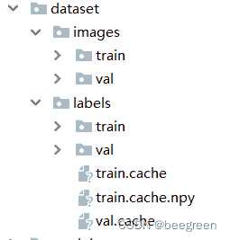
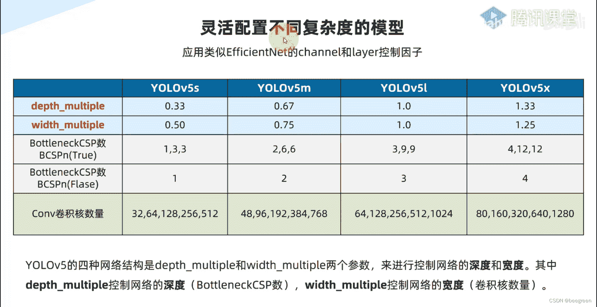
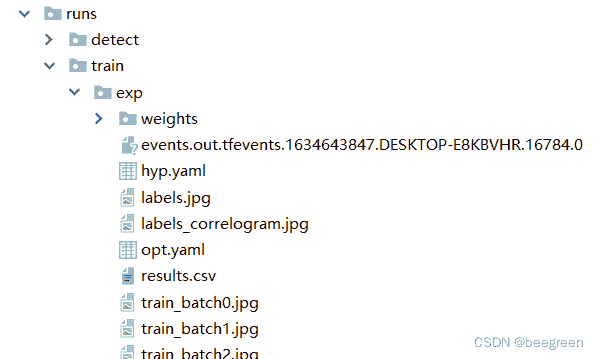
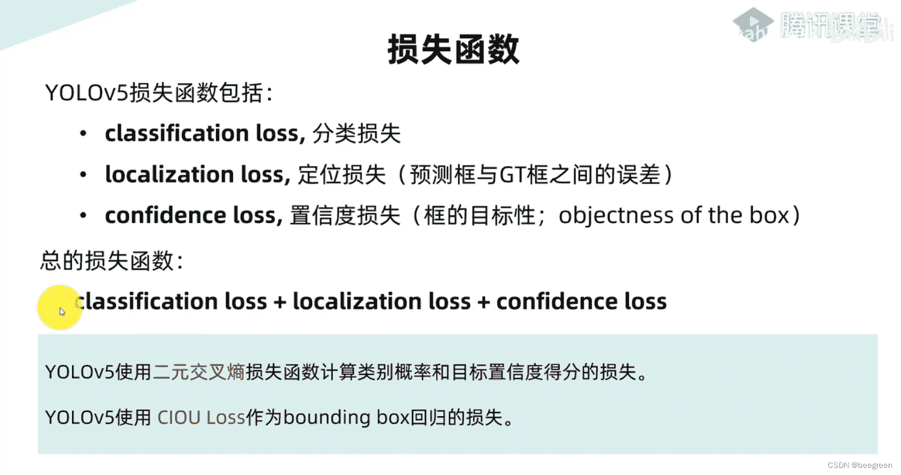
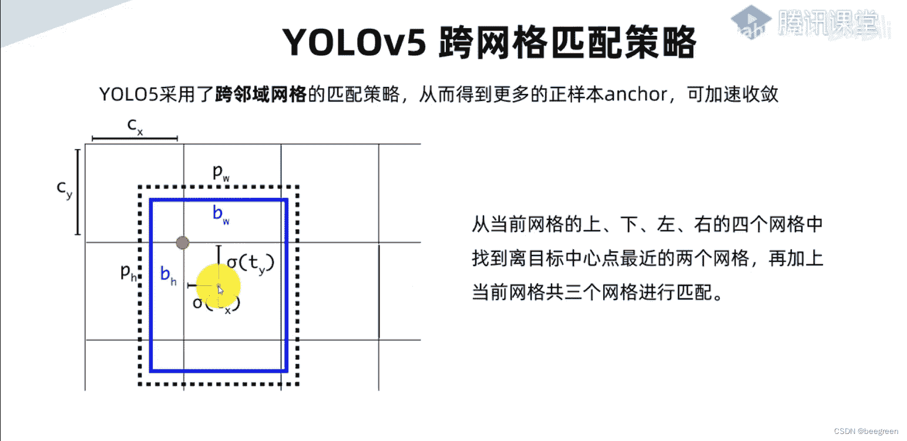
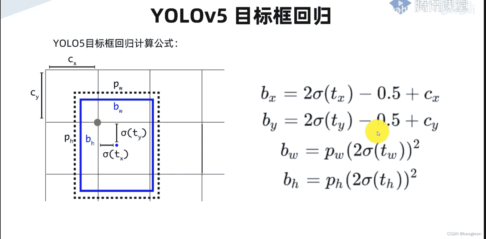
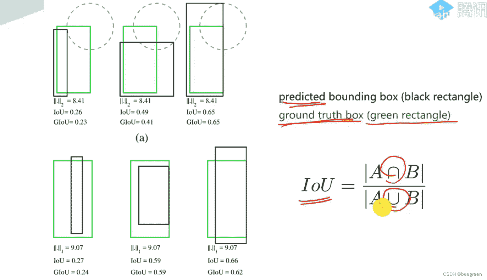

<!--yml
category: 游戏
date: 2023-09-17 14:38:41
-->

# YOLOV5源码的详细解读

> 来源：[https://blog.csdn.net/BeeGreen/article/details/124700445](https://blog.csdn.net/BeeGreen/article/details/124700445)

# YOLOv5 目录结构

├── data：主要是存放一些超参数的配置文件（这些文件（yaml文件）是用来配置训练集和测试集还有验证集的路径的，其中还包括目标检测的种类数和种类的名称）；还有一些官方提供测试的图片。如果是训练自己的数据集的话，那么就需要修改其中的yaml文件。但是自己的数据集不建议放在这个路径下面，而是建议把数据集放到yolov5项目的同级目录下面。

|——dataset :存放自己的数据集，分为images和labels两部分

├── models：里面主要是一些网络构建的配置文件和函数，其中包含了该项目的四个不同的版本，分别为是s、m、l、x。从名字就可以看出，这几个版本的大小。他们的检测测度分别都是从快到慢，但是精确度分别是从低到高。这就是所谓的鱼和熊掌不可兼得。如果训练自己的数据集的话，就需要修改这里面相对应的yaml文件来训练自己模型。

├── utils：存放的是工具类的函数，里面有loss函数，metrics函数，plots函数等等。

├── weights：放置训练好的权重参数pt文件。

├── detect.py：利用训练好的权重参数进行目标检测，可以进行图像、视频和摄像头的检测。

├── train.py：训练自己的数据集的函数。

├── test.py：测试训练的结果的函数。

|—— hubconf.py:pytorch hub 相关代码

|—— sotabench.py: coco数据集测试脚本

|—— tutorial.ipynb: jupyter notebook 演示文件

├──requirements.txt：这是一个文本文件，里面写着使用yolov5项目的环境依赖包的一些版本，可以利用该文本导入相应版本的包。

|—-run日志文件，每次训练的数据，包含权重文件，训练数据，直方图等

|——LICENCE 版权文件

以上就是yolov5项目代码的整体介绍。我们训练和测试自己的数据集基本就是利用到如上的代码。

## 文件夹 data

*   yaml多种数据集的配置文件，如coco，coco128，pascalvoc等
*   hyps 超参数微调配置文件
*   scripts文件夹存放着下载数据集额shell命令

在利用自己的数据集进行训练时，需要将配置文件中的路径进行修改，改成自己对应的数据集所在目录，最好复制+重命名。

```
train: E:/project/yolov5/yolov5-master/dataset/images/train # train images 
val: E:/project/yolov5/yolov5-master/dataset/images/val  # val images 
```

## 文件夹 dataset

存放着自己的数据集，但应按照image和label分开，同时每一个文件夹下，又应该分为train，val。
.cache文件为缓存文件，将数据加载到内存中，方便下次调用快速。


## 文件夹 model

## 网络组件模块

common.py

## 实验测试代码

tryTest.py

## 模型导出脚本

tf.py # 模型导出脚本，负责将模型转化，TensorFlow, Keras and TFLite versions of YOLOv5

## 整体网络代码

yolo.py

## 网络模型配置

yolo5s.yaml


```
# YOLOv5 🚀 by Ultralytics, GPL-3.0 license

# Parameters
nc: 80  # number of classes  类别数
depth_multiple: 0.33  # model depth multiple 控制模型的深度
width_multiple: 0.50  # layer channel multiple 控制conv 通道的个数，卷积核数量
#depth_multiple: 表示BottleneckCSP模块的层缩放因子，将所有的BotleneckCSP模块的B0ttleneck乘上该参数得到最终个数
#width_multiple表示卷积通道的缩放因子，就是将配置里的backbone和head部分有关conv通道的设置，全部乘以该系数
anchors:
  - [10,13, 16,30, 33,23]  # P3/8
  - [30,61, 62,45, 59,119]  # P4/16
  - [116,90, 156,198, 373,326]  # P5/32

# YOLOv5 v6.0 backbone
backbone:
  # [from, number, module, args]
  #from 列参数 ：当前模块输入来自那一层输出，-1 表示是从上一层获得的输入
  #number 列参数：本模块重复次数，1 表示只有一个，3 表示有三个相同的模块
  [[-1, 1, Conv, [64, 6, 2, 2]],  # 0-P1/2
   [-1, 1, Conv, [128, 3, 2]],  # 1-P2/4 128表示128个卷积核，3 表示3*3卷积核，2表示步长为2
   [-1, 3, C3, [128]],
   [-1, 1, Conv, [256, 3, 2]],  # 3-P3/8
   [-1, 6, C3, [256]],
   [-1, 1, Conv, [512, 3, 2]],  # 5-P4/16
   [-1, 9, C3, [512]],
   [-1, 1, Conv, [1024, 3, 2]],  # 7-P5/32
   [-1, 3, C3, [1024]],
   [-1, 1, SPPF, [1024, 5]],  # 9
  ]

# YOLOv5 v6.0 head
#作者没有分neck模块，所以head部分包含了panet+detect部分
head:
  [[-1, 1, Conv, [512, 1, 1]], #上采样
   [-1, 1, nn.Upsample, [None, 2, 'nearest']],
   [[-1, 6], 1, Concat, [1]],  # cat backbone P4
   [-1, 3, C3, [512, False]],  # 13

   [-1, 1, Conv, [256, 1, 1]],
   [-1, 1, nn.Upsample, [None, 2, 'nearest']],
   [[-1, 4], 1, Concat, [1]],  # cat backbone P3
   [-1, 3, C3, [256, False]],  # 17 (P3/8-small)

   [-1, 1, Conv, [256, 3, 2]],
   [[-1, 14], 1, Concat, [1]],  # cat head P4
   [-1, 3, C3, [512, False]],  # 20 (P4/16-medium)

   [-1, 1, Conv, [512, 3, 2]],
   [[-1, 10], 1, Concat, [1]],  # cat head P5
   [-1, 3, C3, [1024, False]],  # 23 (P5/32-large)

   [[17, 20, 23], 1, Detect, [nc, anchors]],  # Detect(P3, P4, P5)
  ] 
```

## 文件夹 runs

文件夹 train 存放着训练数据时记录的数据过程
文件夹 detect 存放着使用训练好的模型，每次预测判断的数据


## 文件夹 utils

### 目标检测性能指标

#### 检测精度

precision，recall，f1 score
iou（intersection over union）交并比
P-R curve (precision-recall curve)
AP (average precison)
mAP (mean ap)

##### 检测速度

前传耗时
每秒帧数FPS
浮点运算量 FLOPS

## 激活函数

activation.py

## 图像增强

augmentations.py

```
# YOLOv5 🚀 by Ultralytics, GPL-3.0 license
"""
Image augmentation functions
"""
## 读取数据集并进行处理 
```

callback.py
datasets.py 读取数据集，并做处理的相关函数

```
# YOLOv5 🚀 by Ultralytics, GPL-3.0 license
"""
Dataloaders and dataset utils
"""
# Get orientation exif tag
# 是专门为数码相机相片设计的
#返回文件列表的hash值
#获取图片的宽高信息
#定义迭代器，用于detect.py
#定义迭代器，用于detect.py文件，处理摄像头
'''
cv2视频函数;
cap.grap()获取视频的下一帧，返回T/F
cap.retrieve()在grap后使用，对获取的帧进行解码，返回T/F
cap.read(frame)结合了grap和retrieve的功能，抓取下一帧并解码
'''
# Ancillary functions ----------------------------------------------------------
#加载图片并根据设定的输入大小与原图片大小比例ratio进行resize

#引入三张随机照片，生成一个图像增强图片
def load_mosaic(self, index):
    # YOLOv5 4-mosaic loader. Loads 1 image + 3 random images into a 4-image mosaic
    labels4, segments4 = [], []
    s = self.img_size
    #随机取mosaic中心点
    yc, xc = [int(random.uniform(-x, 2 * s + x)) for x in self.mosaic_border]  # mosaic center x, y
    #随机取三张图片的索引
    indices = [index] + random.choices(self.indices, k=3)  # 3 additional image indices
    random.shuffle(indices)
    for i, index in enumerate(indices):
        # Load image
        #加载图片并根据设定的输入大小与图片原大小的比例ratio进行resize
        img, _, (h, w) = load_image(self, index)

        # place img in img4
        if i == 0:  # top left
            #初始化大图
            #设置大图上的位置（左上角）
            #选取小图上位置
        #将小图上截取的部分贴到大图上
        img4[y1a:y2a, x1a:x2a] = img[y1b:y2b, x1b:x2b]  # img4[ymin:ymax, xmin:xmax]
        #计算小图到大图上时所产生的偏移，用来计算mosaic增强后的标签框位置
        # Labels
        labels, segments = self.labels[index].copy(), self.segments[index].copy()
        if labels.size:
            #重新调整标签框坐标信息
    # Concat/clip labels
    #调整坐标框在图片内部
    # Augment
    #进行mosaic的时候将四张图片整合到一起之后shape为[2*img_size，2*img_size]
    #随机旋转平移缩放剪切，并resize为输入大小img_size

#随机加入8张照片，构造9张照片
    #随机取三张图片的索引
        # Load image
        #加载图片并根据设定的输入大小与图片原大小的比例ratio进行resize
        img, _, (h, w) = load_image(self, index)
        # place img in img9
        if i == 0:  # center
            #初始化大图
        # Labels
        # Image
    # Offset
    #随机取mosaic中心
    # Concat/clip labels
    # img9, labels9 = replicate(img9, labels9)  # replicate
    # Augment
    # Create folder
    if os.path.exists(path):
        shutil.rmtree(path)  # delete output folder
    os.makedirs(path)  # make new output folder

    # Flatten a recursive directory by bringing all files to top level
    # Convert detection dataset into classification dataset, with one directory per class 
```

## 加载权重文件等函数

donwload.py

## 项目通用代码

general.py

## 通用代码

general.py
#Settings
#设置日志的保存级别
#获取最近训练的权重文件，last.pt
#检查当前的分支和Git上的版本是否一致，否则提醒用户
#检查图像的尺寸是否是32的整数倍。否则调整
#非极大值抑制
#torch_utils 辅助程序代码并行计算，早停策略等函数

## 损失函数

loss.py





## 计算性能指标评价

metrics.py

#计算类别的ap(p,r,f1)
#根据PR曲线计算ap
#定义混淆矩阵

## huizhi t

plots.py

## 文件夹 weight

注意：下载的权重文件，smlx,建议提前到Git上下载好，放在此处，download.py 一般会下载失败

## 检测

detect.py

## 其余

详见：https://www.bilibili.com/video/BV19K4y197u8?p=36

## 代码链接

链接：https://pan.baidu.com/s/1ECUulQzNZrYxpDUjCoZZ7w
提取码：14ql

# 参考来源

https://www.iotword.com/3480.html