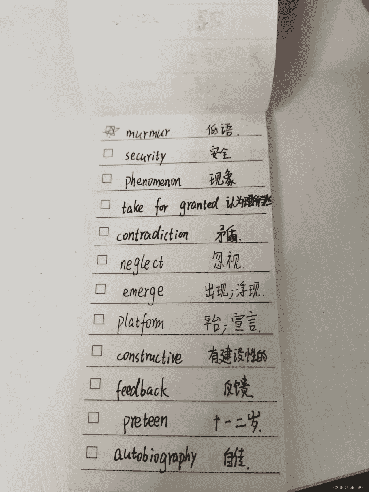
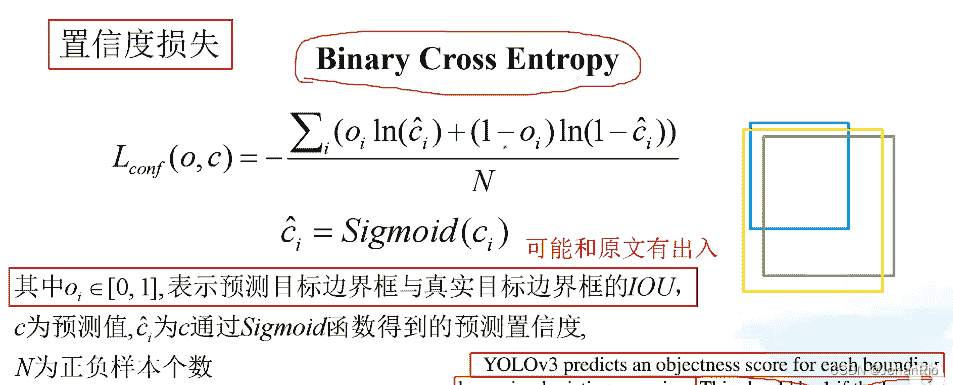
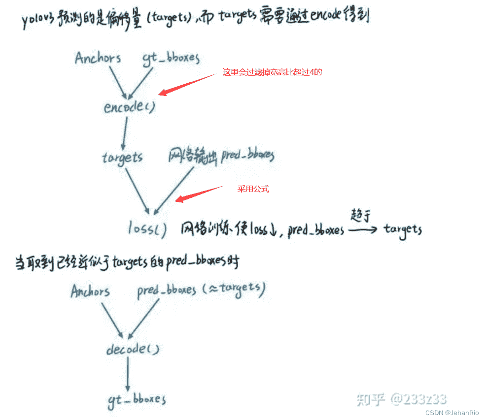
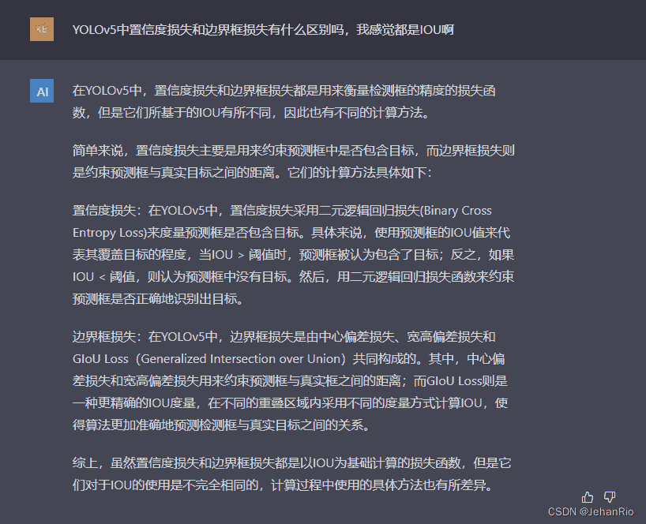

<!--yml
category: 游戏
date: 2023-09-17 14:44:10
-->

# YOLOv5-6.x源码分析（八）---- loss.py

> 来源：[https://blog.csdn.net/weixin_51322383/article/details/130426149](https://blog.csdn.net/weixin_51322383/article/details/130426149)

### 文章目录

*   [前言](#_1)
*   [🚀YOLOv5-6.x源码分析（八）---- loss.py](#YOLOv56x_losspy_21)
*   *   [0\. 导包](#0__22)
    *   [1\. smooth_BCE](#1_smooth_BCE_31)
    *   [2\. BCEBlurWithLogitsLoss](#2_BCEBlurWithLogitsLoss_45)
    *   [3\. FocalLoss](#3_FocalLoss_68)
    *   [4\. QFocalLoss](#4_QFocalLoss_112)
    *   [5\. ComputeLoss](#5_ComputeLoss_141)
    *   *   [5.1 __init__函数](#51___init___142)
        *   [5.2 build_targets](#52_build_targets_184)
        *   [5.3 __call__函数](#53___call___291)
*   [补充](#_375)
*   *   [分类损失（Classification）](#Classification_377)
    *   [置信度损失（Objectness）](#Objectness_385)
    *   [边框损失（Regression）](#Regression_392)
    *   [总结](#_434)

# 前言

**今天是23-04-28，周五，因为要放五一节，就回家了。回家还是很chill的，就是效率没有在学校里面高。预计这个五一节就把这个专栏完成得差不多了吧，后续打算再开个专栏，去写WebServer，正好我的课设也准备交这个上去。**

**今天刚回到家，就看到卧室桌上一个很熟悉的本子，哈哈哈哈这不是我高中记单词的本子吗，怎么跑出来了，估计是被我妈整理房间的时候给翻出来了吧。那时候的字还很青涩（虽然现在也差不多）好多回忆瞬间就涌上心头了。泪目~**


* * *

**OK，言归正传，今天准备谈一下YOLOv5的损失函数`loss.py`。这个文件代码量不多，但我觉得对于理解整个YOLO网络是如何运作的尤为重要，而且难度也不小，而且也非常重要。**

**在准备写这篇博客之前，我又去补了一下知识点，可以看下博主的这两篇：[【PyTorch 理论】交叉熵损失函数的理解](https://blog.csdn.net/qq_38253797/article/details/116225218)和[【PyTorch】两种常用的交叉熵损失函数BCELoss和BCEWithLogitsLoss](https://blog.csdn.net/qq_38253797/article/details/116193381)。**

**损失函数总结：**

*   **交叉熵损失函数**： L = − [ y log ⁡ y ^ + ( 1 − y ) log ⁡ ( 1 − y ^ ) ] \mathrm{L}=-[\mathrm{y} \log \hat{\mathrm{y}}+(1-\mathrm{y}) \log (1-\hat{\mathrm{y}})] L=−[ylogy^​+(1−y)log(1−y^​)]
    预测输出越接近真是样本标签，损失函数L越小。

    BCELoss和BCEWithLogitsLoss是一组常用的二元交叉熵损失函数，常用于二分类问题。区别在于BCELoss的输入需要先进行Sigmoid处理，**而BCEWithLogitsLoss则是将Sigmoid和BCELoss合成一步**，也就是说BCEWithLogitsLoss函数内部自动先对output进行Sigmoid处理，再对output和target进行BCELoss计算。

**导航**：[YOLOv5-6.x源码分析 全流程记录](https://blog.csdn.net/weixin_51322383/article/details/130353834?spm=1001.2014.3001.5502)

* * *

# 🚀YOLOv5-6.x源码分析（八）---- loss.py

## 0\. 导包

```
import torch
import torch.nn as nn

from utils.metrics import bbox_iou
from utils.torch_utils import is_parallel 
```

## 1\. smooth_BCE

```
def smooth_BCE(eps=0.1):  # https://github.com/ultralytics/yolov3/issues/238#issuecomment-598028441
    # return positive, negative label smoothing BCE targets
    return 1.0 - 0.5 * eps, 0.5 * eps 
```

**这段代码是标签平滑的策略（trick）**，目的是防止过拟合。

该函数将原本的正负样本1和0修改为`1.0 - 0.5 * eps`,和`0.5 * eps`

在ComputeLoss中定义，并在`__call__`中调用


## 2\. BCEBlurWithLogitsLoss

```
class BCEBlurWithLogitsLoss(nn.Module):
    # BCEwithLogitLoss() with reduced missing label effects.
    def __init__(self, alpha=0.05):
        super().__init__()
        self.loss_fcn = nn.BCEWithLogitsLoss(reduction='none')  # must be nn.BCEWithLogitsLoss()
        self.alpha = alpha

    def forward(self, pred, true):
        loss = self.loss_fcn(pred, true)
        pred = torch.sigmoid(pred)  # prob from logits
        # dx = [-1, 1]  当pred=1 true=0时(网络预测说这里有个obj但是gt说这里没有), dx=1 => alpha_factor=0 => loss=0
        # 这种就是检测成正样本了但是检测错了（false positive）或者missing label的情况 这种情况不应该过多的惩罚->loss=0
        dx = pred - true  # reduce only missing label effects
        # 如果采样绝对值的话 会减轻pred和gt差异过大而造成的影响
        # dx = (pred - true).abs()  # reduce missing label and false label effects
        alpha_factor = 1 - torch.exp((dx - 1) / (self.alpha + 1e-4))
        loss *= alpha_factor
        return loss.mean() 
```

这段代码是BCE函数的一个替代，可以直接在ComputeLoss类中的`__init__`中代替传统的BCE函数

## 3\. FocalLoss

```
class FocalLoss(nn.Module):
    # Wraps focal loss around existing loss_fcn(), i.e. criteria = FocalLoss(nn.BCEWithLogitsLoss(), gamma=1.5)
    def __init__(self, loss_fcn, gamma=1.5, alpha=0.25):
        super().__init__()
        self.loss_fcn = loss_fcn  # must be nn.BCEWithLogitsLoss()
        self.gamma = gamma  # 参数gamma  用于削弱简单样本对loss的贡献程度
        self.alpha = alpha  # 参数alpha  用于平衡正负样本个数不均衡的问题
        self.reduction = loss_fcn.reduction
        # focalloss中的BCE函数的reduction='None'  BCE不使用Sum或者Mean
        self.loss_fcn.reduction = 'none'  # required to apply FL to each element

    def forward(self, pred, true):
        loss = self.loss_fcn(pred, true)    # 正常BCE的loss:   loss = -log(p_t)
        # p_t = torch.exp(-loss)
        # loss *= self.alpha * (1.000001 - p_t) ** self.gamma  # non-zero power for gradient stability

        # TF implementation https://github.com/tensorflow/addons/blob/v0.7.1/tensorflow_addons/losses/focal_loss.py
        pred_prob = torch.sigmoid(pred)  # prob from logits
        p_t = true * pred_prob + (1 - true) * (1 - pred_prob)
        alpha_factor = true * self.alpha + (1 - true) * (1 - self.alpha)
        modulating_factor = (1.0 - p_t) ** self.gamma
        # 公式内容
        loss *= alpha_factor * modulating_factor

        if self.reduction == 'mean':
            return loss.mean()
        elif self.reduction == 'sum':
            return loss.sum()
        else:  # 'none'
            return loss 
```

这个损失函数的主要思路是：**希望那些hard examples对损失的贡献变大，使网络更倾向于从这些样本上学习。防止由于easy examples过多，主导整个损失函数。**

优点：

1.  解决了one-stage object detection中图片中正负样本（前景和背景）不均衡的问题；
2.  降低简单样本的权重，使损失函数更关注困难样本；

同样在ComputeLoss中用来代替原本的BCEcls和BCEobj


## 4\. QFocalLoss

```
class QFocalLoss(nn.Module):
    # Wraps Quality focal loss around existing loss_fcn(), i.e. criteria = FocalLoss(nn.BCEWithLogitsLoss(), gamma=1.5)
    def __init__(self, loss_fcn, gamma=1.5, alpha=0.25):
        super().__init__()
        self.loss_fcn = loss_fcn  # must be nn.BCEWithLogitsLoss()
        self.gamma = gamma
        self.alpha = alpha
        self.reduction = loss_fcn.reduction
        self.loss_fcn.reduction = 'none'  # required to apply FL to each element

    def forward(self, pred, true):
        loss = self.loss_fcn(pred, true)

        pred_prob = torch.sigmoid(pred)  # prob from logits
        alpha_factor = true * self.alpha + (1 - true) * (1 - self.alpha)
        modulating_factor = torch.abs(true - pred_prob) ** self.gamma
        loss *= alpha_factor * modulating_factor

        if self.reduction == 'mean':
            return loss.mean()
        elif self.reduction == 'sum':
            return loss.sum()
        else:  # 'none'
            return loss 
```

**用来代替FocalLoss，可以直接在`__init__`中替换**

## 5\. ComputeLoss

### 5.1 __init__函数

```
class ComputeLoss:
    sort_obj_iou = False

    # Compute losses
    def __init__(self, model, autobalance=False):
        device = next(model.parameters()).device  # get model device
        h = model.hyp  # hyperparameters

        # Define criteria
        # 定义分类损失和置信度损失
        BCEcls = nn.BCEWithLogitsLoss(pos_weight=torch.tensor([h['cls_pw']], device=device))
        BCEobj = nn.BCEWithLogitsLoss(pos_weight=torch.tensor([h['obj_pw']], device=device))

        # Class label smoothing https://arxiv.org/pdf/1902.04103.pdf eqn 3
        # 标签平滑处理，cp代表positive的标签值，cn代表negative的标签值
        self.cp, self.cn = smooth_BCE(eps=h.get('label_smoothing', 0.0))  # positive, negative BCE targets

        # Focal loss    g=0，代表不用focal loss
        g = h['fl_gamma']  # focal loss gamma
        if g > 0:
            # g > 0, 将分类损失和置信度损失(BCE)都换成focalloss损失函数
            BCEcls, BCEobj = FocalLoss(BCEcls, g), FocalLoss(BCEobj, g)
            # BCEcls, BCEobj = QFocalLoss(BCEcls, g), QFocalLoss(BCEobj, g)

        # 返回的是模型的检测头 Detector 3个 分别对应产生三个输出feature map
        m = de_parallel(model).model[-1]  # Detect() module
        # balance用来设置三个feature map对应输出的置信度损失系数(平衡三个feature map的置信度损失)
        self.balance = {3: [4.0, 1.0, 0.4]}.get(m.nl, [4.0, 1.0, 0.25, 0.06, 0.02])  # P3-P7
        # 三个预测头的下采样率m.stride: [8, 16, 32]  .index(16): 求出下采样率stride=16的索引
        # 这个参数会用来自动计算更新3个feature map的置信度损失系数self.balance
        self.ssi = list(m.stride).index(16) if autobalance else 0  # stride 16 index
        # self.gr: 计算真实框的置信度标准的iou ratio    self.autobalance: 是否自动更新各feature map的置信度损失平衡系数  默认False
        self.BCEcls, self.BCEobj, self.gr, self.hyp, self.autobalance = BCEcls, BCEobj, 1.0, h, autobalance
        self.na = m.na  # number of anchors 3个
        self.nc = m.nc  # number of classes 类别数
        self.nl = m.nl  # number of layers
        self.anchors = m.anchors
        self.device = device 
```

**这部分就是定义了一些后面要使用的变量。**

### 5.2 build_targets

```
 def build_targets(self, p, targets):
        # p: 网络输出；targets：GT框；
        # Build targets for compute_loss(), input targets(image,class,x,y,w,h)
        na, nt = self.na, targets.shape[0]  # number of anchors, targets
        tcls, tbox, indices, anch = [], [], [], [] # 初始化
        # gain是为了后面将targets=[na,nt,7]中的归一化了的xywh映射到相对feature map尺度上
        # 7: image_index+class+xywh+anchor_index
        gain = torch.ones(7, device=self.device)  # normalized to gridspace gain
        # anchor索引，后面有用，用来表示当前bbox和当前层的哪个anchor匹配
        ai = torch.arange(na, device=self.device).float().view(na, 1).repeat(1, nt)  # same as .repeat_interleave(nt)
        # 先repeat targets和当前层anchor个数一样，相当于每个bbox变成了3个，然后和3个anchor单独匹配
        targets = torch.cat((targets.repeat(na, 1, 1), ai[..., None]), 2)  # append anchor indices

        # 这两个变量是用来扩展正样本的 因为预测框预测到target有可能不止当前的格子预测到了
        # 可能周围的格子也预测到了高质量的样本 我们也要把这部分的预测信息加入正样本中
        # 设置网络中心偏移量
        g = 0.5  # bias 用来衡量target中心点离哪个格子近
        # 附近4个网格
        off = torch.tensor(
            [
                [0, 0],
                [1, 0],
                [0, 1],
                [-1, 0],
                [0, -1],  # j,k,l,m
                # [1, 1], [1, -1], [-1, 1], [-1, -1],  # jk,jm,lk,lm    斜方向
            ],
            device=self.device).float() * g  # offsets

        # 对每个检测层进行处理
        for i in range(self.nl):    # 三个尺度的预测特征图输出分支
            # 当前feature map对应的三个anchor尺寸
            anchors, shape = self.anchors[i], p[i].shape
            # [1, 1, 1, 1, 1, 1, 1] -> [1, 1, 112, 112, 112,112, 1]=image_index+class+xywh+anchor_index
            gain[2:6] = torch.tensor(shape)[[3, 2, 3, 2]]  # xyxy gain

            # Match targets to anchors
            t = targets * gain  # shape(3,n,7)

            if nt:  # 开始匹配
                # Matches
                r = t[..., 4:6] / anchors[:, None]  # wh ratio

                # 筛选条件  GT与anchor的宽比或高比超过一定的阈值 就当作负样本

                # 筛选出宽比w1/w2 w2/w1 高比h1/h2 h2/h1中最大的那个
                # .max(2)返回宽比 高比两者中较大的一个值和它的索引  [0]返回较大的一个值
                # j: [3, 63]  False: 当前anchor是当前gt的负样本  True: 当前anchor是当前gt的正样本
                j = torch.max(r, 1 / r).max(2)[0] < self.hyp['anchor_t']  # compare
                # j = wh_iou(anchors, t[:, 4:6]) > model.hyp['iou_t']  # iou(3,n)=wh_iou(anchors(3,2), gwh(n,2))
                t = t[j]  # filter

                # Offsets 筛选当前格子周围格子 找到2个离target中心最近的两个格子  可能周围的格子也预测到了高质量的样本 我们也要把这部分的预测信息加入正样本中
                # 除了target所在的当前格子外, 还有2个格子对目标进行检测(计算损失) 也就是说一个目标需要3个格子去预测(计算损失)
                # 首先当前格子是其中1个 再从当前格子的上下左右四个格子中选择2个 用这三个格子去预测这个目标(计算损失)
                # feature map上的原点在左上角 向右为x轴正坐标 向下为y轴正坐标
                gxy = t[:, 2:4]  # grid xy
                gxi = gain[[2, 3]] - gxy  # inverse
                # 筛选中心坐标 距离当前grid_cell的左、上方偏移小于g=0.5 且 中心坐标必须大于1(坐标不能在边上 此时就没有4个格子了)
                # j: [126] bool 如果是True表示当前target中心点所在的格子的左边格子也对该target进行回归(后续进行计算损失)
                # k: [126] bool 如果是True表示当前target中心点所在的格子的上边格子也对该target进行回归(后续进行计算损失)
                j, k = ((gxy % 1 < g) & (gxy > 1)).T
                # 筛选中心坐标 距离当前grid_cell的右、下方偏移小于g=0.5 且 中心坐标必须大于1(坐标不能在边上 此时就没有4个格子了)
                # l: [126] bool 如果是True表示当前target中心点所在的格子的右边格子也对该target进行回归(后续进行计算损失)
                # m: [126] bool 如果是True表示当前target中心点所在的格子的下边格子也对该target进行回归(后续进行计算损失)
                l, m = ((gxi % 1 < g) & (gxi > 1)).T
                # j: [5, 126]  torch.ones_like(j): 当前格子, 不需要筛选全是True  j, k, l, m: 左上右下格子的筛选结果
                j = torch.stack((torch.ones_like(j), j, k, l, m))
                # 得到筛选后所有格子的正样本 格子数<=3*126 都不在边上等号成立
                # t: [126, 7] -> 复制5份target[5, 126, 7]  分别对应当前格子和左上右下格子5个格子
                # j: [5, 126] + t: [5, 126, 7] => t: [378, 7] 理论上是小于等于3倍的126 当且仅当没有边界的格子等号成立
                t = t.repeat((5, 1, 1))[j]
                # 添加偏移量
                offsets = (torch.zeros_like(gxy)[None] + off[:, None])[j]
            else:
                t = targets[0]
                offsets = 0

            # Define
            bc, gxy, gwh, a = t.chunk(4, 1)  # (image, class), grid xy, grid wh, anchors
            a, (b, c) = a.long().view(-1), bc.long().T  # anchors, image, class
            gij = (gxy - offsets).long()    # 预测真实框的网格所在的左上角坐标(有左上右下的网格)
            gi, gj = gij.T  # grid indices

            # Append
            # gj: 网格的左上角y坐标  gi: 网格的左上角x坐标
            indices.append((b, a, gj.clamp_(0, shape[2] - 1), gi.clamp_(0, shape[3] - 1)))  # image, anchor, grid
            tbox.append(torch.cat((gxy - gij, gwh), 1))  # box
            anch.append(anchors[a])  # anchors
            tcls.append(c)  # class

        return tcls, tbox, indices, anch 
```

**这段代码主要是处理当前批次的所有图片的targets，将预测的格式转化为便于计算loss的target格式。筛选条件是比较GT和anchor的宽比和高比，大于一定的阈值就是负样本，反之正样本。**

**作用：用于网络训练时计算loss所需要的目标框，即正样本。**

筛选到的正样本信息（image_index, anchor_index, gridy, gridx），传入__call__函数，通过这个信息去筛选pred每个grid预测得到的信息，保留对应grid_cell上的正样本。通过build_targets筛选的GT中的正样本和pred筛选出的对应位置的预测样本进行计算损失。

为什么原图上归一化的框特征图的大小就是特征图上的坐标了呢？

即这行代码：`t = targets*gain` ，具体可看这篇博文[博客](https://blog.csdn.net/qq_21539375/article/details/118345636)
对于下采样32倍的特征图来说，每一个格子对应着原图上( h / 32 , w / 32 ) (h/32,w/32)(h/32,w/32)的大小,其中h,w是原图的高和宽

### 5.3 __call__函数

```
 def __call__(self, p, targets):  # predictions, targets
    	'''
            :params targets: 数据增强后的真实框 [num_object,  batch_index+class+xywh] 我这里的数据是[35,6]
            :params loss * bs: 整个batch的总损失  进行反向传播
            :params torch.cat((lbox, lobj, lcls, loss)).detach(): 回归损失、置信度损失、分类损失和总损失 这个参数只用来可视化参数或保存信息
        '''
        # 初始化三种损失
        lcls = torch.zeros(1, device=self.device)  # class loss
        lbox = torch.zeros(1, device=self.device)  # box loss
        lobj = torch.zeros(1, device=self.device)  # object loss

        # tcls: 表示这个target所属的class index
        # tbox: xywh 其中xy为这个target对当前grid_cell左上角的偏移量
        # indices: b: 表示这个target属于的image index
        #          a: 表示这个target使用的anchor index
        #          gj: 经过筛选后确定某个target在某个网格中进行预测(计算损失)  gj表示这个网格的左上角y坐标
        #          gi: 表示这个网格的左上角x坐标
        # anch: 表示这个target所使用anchor的尺度（相对于这个feature map）  注意可能一个target会使用大小不同anchor进行计算
        tcls, tbox, indices, anchors = self.build_targets(p, targets)  # targets

        # Losses
        for i, pi in enumerate(p):  # layer index, layer predictions
            b, a, gj, gi = indices[i]  # image, anchor, gridy, gridx
            tobj = torch.zeros(pi.shape[:4], dtype=pi.dtype, device=self.device)  # target obj

            n = b.shape[0]  # number of targets
            if n:
                # pxy, pwh, _, pcls = pi[b, a, gj, gi].tensor_split((2, 4, 5), dim=1)  # faster, requires torch 1.8.0
                pxy, pwh, _, pcls = pi[b, a, gj, gi].split((2, 2, 1, self.nc), 1)  # target-subset of predictions

                # Regression
                pxy = pxy.sigmoid() * 2 - 0.5
                pwh = (pwh.sigmoid() * 2) ** 2 * anchors[i]
                pbox = torch.cat((pxy, pwh), 1)  # predicted box
                iou = bbox_iou(pbox, tbox[i], CIoU=True).squeeze()  # iou(prediction, target)
                lbox += (1.0 - iou).mean()  # iou loss

                # Objectness    只计算所有正样本的回归损失
                iou = iou.detach().clamp(0).type(tobj.dtype)
                if self.sort_obj_iou:
                    j = iou.argsort()
                    # 排序之后 如果同一个grid出现两个gt 那么我们经过排序之后每个grid中的score_iou都能保证是最大的
                    # (小的会被覆盖 因为同一个grid坐标肯定相同)那么从时间顺序的话, 最后1个总是和最大的IOU去计算LOSS, 梯度传播
                    b, a, gj, gi, iou = b[j], a[j], gj[j], gi[j], iou[j]
                if self.gr < 1:
                    iou = (1.0 - self.gr) + self.gr * iou
                # 预测信息有置信度 但是真实框信息是没有置信度的 所以需要我们人为的给一个标准置信度
                # self.gr是iou ratio [0, 1]  self.gr越大置信度越接近iou  self.gr越小置信度越接近1(人为加大训练难度)
                tobj[b, a, gj, gi] = iou  # iou ratio

                # Classification    只计算所有正样本的分类损失
                if self.nc > 1:  # cls loss (only if multiple classes)
                    t = torch.full_like(pcls, self.cn, device=self.device)  # targets
                    t[range(n), tcls[i]] = self.cp
                    lcls += self.BCEcls(pcls, t)  # BCE

                # Append targets to text file
                # with open('targets.txt', 'a') as file:
                #     [file.write('%11.5g ' * 4 % tuple(x) + '\n') for x in torch.cat((txy[i], twh[i]), 1)]

            obji = self.BCEobj(pi[..., 4], tobj)
            # 每个feature map的置信度损失权重不同  要乘以相应的权重系数self.balance[i]
            # 一般来说，检测小物体的难度大一点，所以会增加大特征图的损失系数，让模型更加侧重小物体的检测
            lobj += obji * self.balance[i]  # obj loss
            if self.autobalance:
                self.balance[i] = self.balance[i] * 0.9999 + 0.0001 / obji.detach().item()

        if self.autobalance:
            self.balance = [x / self.balance[self.ssi] for x in self.balance]
        lbox *= self.hyp['box']
        lobj *= self.hyp['obj']
        lcls *= self.hyp['cls']
        bs = tobj.shape[0]  # batch size

        return (lbox + lobj + lcls) * bs, torch.cat((lbox, lobj, lcls)).detach() 
```

**分别计算了三类损失，在train.py中调用返回**

```
loss, loss_items = compute_loss(pred, targets.to(device)) 
```

* * *

# 补充

又学了一遍loss，这次算是真的学通了！！！

## 分类损失（Classification）

分类损失采用的是nn.BCEWithLogitsLoss，即二分类损失，你没听错，就是用的二分类损失，比如现在有4个分类：猫、狗、猪、鸡，当前标签真值为猪，那么计算损失的时候，targets就是[0, 0, 1, 0]。

按照640乘640分辨率，3个输出层来算的话，P3是80乘80个格子，P4是40乘40，P5是20乘20，一共有8400个格子，并不是每一个格子上的输出都要去做分类损失计算的，**只有负责预测对应物体的格子才需要做分类损失计算（边框损失计算也是一样）**。至于哪些格子才会负责去预测对应的物体，这个逻辑下面再说。

## 置信度损失（Objectness）

置信度损失就是跟IOU挂钩的。

置信度损失同样也是BCEWithLogitsLoss，不过**置信度是每一个格子都要做损失计算的**，因为最终在使用的时候我们首先就是由置信度阈值来判断对应格子的输出是不是可信的。**置信度的真值并不是固定的，如果该格子负责预测对应的物体，那么置信度真值就是预测边框与标签边框的IOU。如果不负责预测任何物体，那真值就是0。**


## 边框损失（Regression）

样本分配是在网络最后输出的三个不同下采样倍数的特征图上逐层进行的：

*   首先将归一化的gt映射到特征图对应的大小；
*   分别计算gt与该尺度特征图上预设的三个不同大小的anchor的宽高比并判断是否满足：1/thr < ratio <thr，如果满足说明这个gt与anchor尺寸匹配，接下来会进一步为其分配正样本；不满足则说明这个gt与这个anchor尺寸不匹配，不会为其匹配对应anchor的正样本。假设我们有m个标注的真实边界框gt，那么一层特征图上理论最多会有3*m对匹配成功的gt-anchor（因为YOLOv3&v5中每个格点对应3个anchor）；

接下来就是anchor在模型中的应用了。这就涉及到了yolo系列目标框回归的过程了。

边框损失由预测边框与标签边框的IOU来定，IOU越大，损失自然越小，IOU如果是1，损失就是0，IOU如果是0，损失就越大，上限定为1，所以边框损失就是1-IOU。


在计算box IOU损失时，用的是这个公式：

如图所示，我们检测到的不是框，而是偏移量。得到bx,by,bw,bh就是最终的检测结果。

其中，tx、ty、tw、th为模型预测输出，bx、by、bw、bh为最终预测目标边框中心点，宽高。

> 关于anchor，看这里：[YOLO v2](https://blog.csdn.net/u012655441/article/details/108042286#t5)。anchor主要是可以加速训练（从直接预测位置变为预测偏移量）

**过程总结**

1.  **首先通过gt与当前层anchor做一遍过滤**。对于任何一层计算当前gt与当前层anchor的匹配程度，不采用IoU，而采用shape比例。如果anchor与gt的宽高比差距大于4，则认为不匹配，保留下匹配的anchor。（实际上把把标签重复3次，标签新增一列）
2.  **最后根据留下的bbox，在上下左右四个网格四个方向扩增采样。**
3.  只有最后留下来的bbox，才会去进行上方公式的计算（encode）。我们将这个anchor和他对应的gt做偏差，进行encoding，得到target，再将pred做encoding，这二者放入损失函数中进行loss计算，使pred逐渐趋于anchor，这里的损失函数用的1-CIoU。在后面的置信度损失也用到了这个CIoU，不过他用的损失函数是二元交叉熵损失函数。

```
iou = bbox_iou(pbox, tbox[i], CIoU=True).squeeze()  # iou(prediction, target)
lbox += (1.0 - iou).mean()  # iou loss 
```

> [MMDetection移植yolov5——(二)前向推理](https://zhuanlan.zhihu.com/p/599643109)

附一张流程图，写的太好了！还就那个醍醐灌顶！！！



## 总结

这个文件我觉得是整个YOLOv5源码中最难的一个了，太难理解了，尤其是我的pytorch还不是很熟，各种花里胡哨的矩阵操作看的我太痛苦了。尽管写这篇博客的时候看了大量的其他博客，但还是难以理解，我太难了TnT

* * *

之前一直觉得置信度损失和bbox损失很像，一直云里雾里的，问了下gpt，感觉还是讲的挺透彻的。



* * *

**References**

> CSDN 西西弗Sisyphus： [目标检测 YOLOv5 - Sample Assignment](https://blog.csdn.net/flyfish1986/article/details/119332396)
> CSDN 满船清梦压星河HK：[【YOLOV5-5.x 源码解读】loss.py](https://blog.csdn.net/qq_38253797/article/details/119444854)
> CSDN 小哈蒙德：[YOLO-V3-SPP 训练时正样本筛选源码解析之build_targets](https://blog.csdn.net/qq_38109282/article/details/119411005)
> CSDN guikunchen:[yolov5 代码解读 损失函数 loss.py](https://blog.csdn.net/guikunchen/article/details/118452790)
> CSDN gorgeous(๑>؂<๑）[【代码解读】超详细，YOLOV5之build_targets函数解读。](https://blog.csdn.net/wxd1233/article/details/126148680)
> B站 薛定谔的AI [yolo v5 解读，训练，复现](https://www.bilibili.com/video/BV1JR4y1g77H?p=6&vd_source=6ddff31927787e4db97428b9835fa86f)