<!--yml
category: 游戏
date: 2023-02-28 16:01:25
-->

# 【Yolov5】1.认真总结6000字Yolov5保姆级教程（2022.06.28全新版本v6.1）_若oo尘的博客-CSDN博客_yolov5master

> 来源：[https://blog.csdn.net/m0_53392188/article/details/119334634](https://blog.csdn.net/m0_53392188/article/details/119334634)

**目录**

[一、前言](#%E4%B8%80%E3%80%81%E5%89%8D%E8%A8%80)

[二、学习内容](#%E4%B8%80%E3%80%81%E5%AD%A6%E4%B9%A0%E5%86%85%E5%AE%B9)

[​编辑](#%E2%80%8B%E7%BC%96%E8%BE%91)

[三、版本与配置声明](#%E4%BA%8C%E3%80%81%E7%89%88%E6%9C%AC%E4%B8%8E%E9%85%8D%E7%BD%AE%E5%A3%B0%E6%98%8E)

[四、Yolov5的准备](#%E4%B8%89%E3%80%81Yolov5%E7%9A%84%E5%87%86%E5%A4%87)

[1.基本的Python环境配置](#1.%E5%9F%BA%E6%9C%AC%E7%9A%84Python%E7%8E%AF%E5%A2%83%E9%85%8D%E7%BD%AE)

[2.下载Yolov5](#1.%E4%B8%8B%E8%BD%BDYolov5)

[3.安装依赖库](#2.%E5%AE%89%E8%A3%85%E4%BE%9D%E8%B5%96%E5%BA%93)

[4.初步测试：detect.py](#3.%E8%BF%90%E8%A1%8C%E6%A3%80%E6%B5%8B)

[五、训练集要求及路径要求](#%E5%9B%9B%E3%80%81%E8%AE%AD%E7%BB%83%E9%9B%86)

[六、制作自己的数据集之制作标签](#%E4%BA%94%E3%80%81%E5%88%B6%E4%BD%9C%E6%A0%87%E7%AD%BE)

[1.下载labelme](#1.%E4%B8%8B%E8%BD%BDlabelme)

[2.安装依赖库](#2.%E5%AE%89%E8%A3%85%E4%BE%9D%E8%B5%96%E5%BA%93)

[3.labelme操作](#3.labelme%E6%93%8D%E4%BD%9C)

[ 4.json转txt](#%C2%A04.json%E8%BD%ACtxt)

[ 5.xml转txt](#%C2%A05.xml%E8%BD%ACtxt)

[七、修改配置文件](#%E4%BA%94%E3%80%81%E4%BF%AE%E6%94%B9%E9%85%8D%E7%BD%AE%E6%96%87%E4%BB%B6)

[1.coco128.yaml->wzry_parameter.yaml](#1.coco128.yaml)

[2.yolov5x.yaml->wzry_model.yaml](#2.yolov5%E9%85%8D%E7%BD%AE)

[八、开始训练train](#%C2%A0%E5%85%AD%E3%80%81%E8%AE%AD%E7%BB%83train)

[1.调参](#1.%E8%B0%83%E5%8F%82)

[2.结果](#2.%E7%BB%93%E6%9E%9C)

[九、识别检测detect.py](#%E4%B8%83%E3%80%81%E8%AF%86%E5%88%ABdetect)

[1.调参](#1.%E8%B0%83%E5%8F%82)

[ 2.结果](#%C2%A02.%E7%BB%93%E6%9E%9C)

[十、debug](#%E5%85%AB%E3%80%81debug)

[十一、如果自己电脑算力不够怎么办？](#%E5%8D%81%E4%B8%80%E3%80%81%E5%A6%82%E6%9E%9C%E8%87%AA%E5%B7%B1%E7%94%B5%E8%84%91%E7%AE%97%E5%8A%9B%E4%B8%8D%E5%A4%9F%E6%80%8E%E4%B9%88%E5%8A%9E%EF%BC%9F)

[十二、是否可以部署至树莓派？](#%E5%8D%81%E4%BA%8C%E3%80%81%E6%98%AF%E5%90%A6%E5%8F%AF%E4%BB%A5%E9%83%A8%E7%BD%B2%E8%87%B3%E6%A0%91%E8%8E%93%E6%B4%BE%EF%BC%9F)

[十三、百度网盘资源](#%E5%85%AB%E3%80%81%E7%99%BE%E5%BA%A6%E7%BD%91%E7%9B%98%E8%B5%84%E6%BA%90)

[十四、结语](#%E4%B9%9D%E3%80%81%E7%BB%93%E8%AF%AD)

# 一、前言

1.集成的资源我放在了文末，包括我自己做成的成品，可以直接train与detect。我发在百度网盘上。

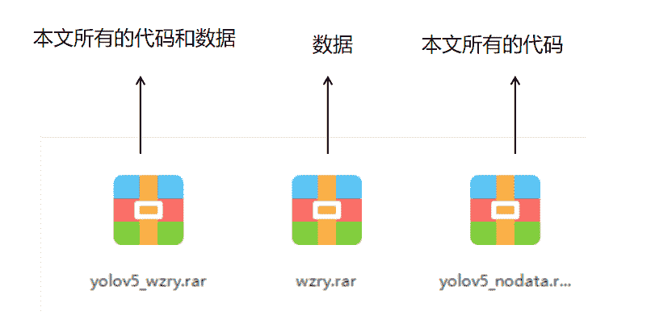

 2.本文目的**主要是能够让读者复现，直接使用，而且少讲原理**。如果想深入了解yolov5的原理，可以去看热度比较高的博主做的

3.如果是制作自己的数据集，那么有一个自己给训练集打标签的过程，那么需要看第五部分；如果用公开的数据集，那么可跳过第五部分

4.本次大更新，采用**2022.06.28版本，应该是v6.1**，以下是我的基本配置


# 二、学习内容

2020年6月25日，Ultralytics发布了YOLOV5 的第一个正式版本，其性能与YOLO V4不相伯仲，同样也是现今最先进的对象检测技术，并在推理速度上是目前最强，yolov5按大小分为四个模型yolov5s、yolov5m、yolov5l、yolov5x。

今天我们来学习一下如何简单使用这个算法

文章特点：一个完整的流程，从头教到尾，不讲冗长的理论，实操，看完本篇文章，训练与识别都是没有问题的，我以王者荣耀作为训练集，可以先看看效果

[Yolov5展示视频（b站），可以直接戳这个也可以看下面俩](https://www.bilibili.com/video/BV1Qg41177G4/ "Yolov5展示视频（b站），可以直接戳这个也可以看下面俩")

以下是操作的流程图

# 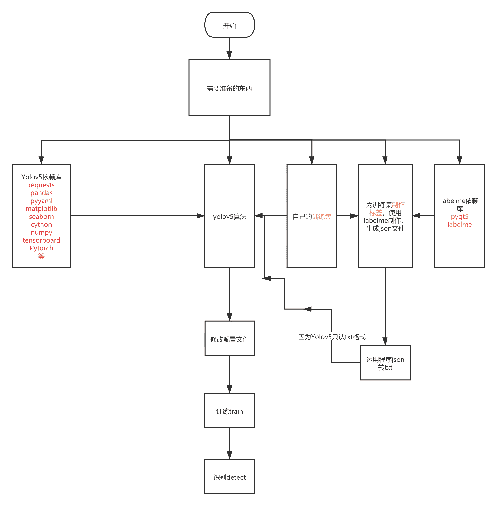

# 三、版本与配置声明

> ```
> # YOLOv5 requirements
> # Usage: pip install -r requirements.txt
> 
> # Base ----------------------------------------
> matplotlib>=3.2.2
> numpy>=1.18.5
> opencv-python>=4.1.1
> Pillow>=7.1.2
> PyYAML>=5.3.1
> requests>=2.23.0
> scipy>=1.4.1  # Google Colab version
> torch>=1.7.0
> torchvision>=0.8.1
> tqdm>=4.41.0
> protobuf<4.21.3  # https://github.com/ultralytics/yolov5/issues/8012
> 
> # Logging -------------------------------------
> tensorboard>=2.4.1
> # wandb
> 
> # Plotting ------------------------------------
> pandas>=1.1.4
> seaborn>=0.11.0
> 
> # Export --------------------------------------
> # coremltools>=4.1  # CoreML export
> # onnx>=1.9.0  # ONNX export
> # onnx-simplifier>=0.3.6  # ONNX simplifier
> # scikit-learn==0.19.2  # CoreML quantization
> # tensorflow>=2.4.1  # TFLite export
> # tensorflowjs>=3.9.0  # TF.js export
> # openvino-dev  # OpenVINO export
> 
> # Extras --------------------------------------
> ipython  # interactive notebook
> psutil  # system utilization
> thop  # FLOPs computation
> # albumentations>=1.0.3
> # pycocotools>=2.0  # COCO mAP
> # roboflow
> 
> ```

联想小新Air 15

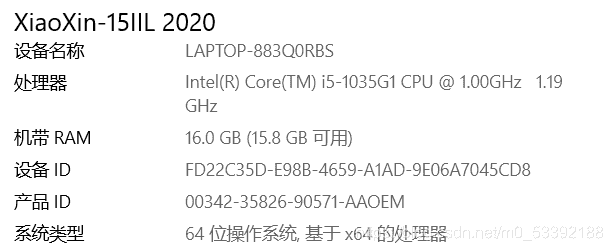

# 四、Yolov5的准备

## 1.基本的Python环境配置

我采用的是**Anaconda+Pycharm**的配置，大家要了解一些关于pip的指令，方便管理包，这里就不赘述了。

## 2.下载Yolov5

[https://github.com/ultralytics/yolov5](https://github.com/ultralytics/yolov5 "https://github.com/ultralytics/yolov5")，放在合理的位置，如果这个下的慢的话见文末资源

## 3.安装依赖库

当我们下好yolov5后，可以发现有一个requirements.txt文件，我们可以使用Anaconda Prompt，切换到咱们Yolov5的位置，pip install -r requirements.txt即可一步到位全部下完。

**大部分都能pip install 。重点说两个**

（1）对于Pytorch，如果文件较大没有办法下完的话，可以用我下面的网址单独下载whl文件，

[https://download.pytorch.org/whl/torch_stable.html](https://download.pytorch.org/whl/torch_stable.html "https://download.pytorch.org/whl/torch_stable.html")

（2）对于wandb，[wandb安装方法](https://blog.csdn.net/hhhhhhhhhhwwwwwwwwww/article/details/116124285?ops_request_misc=%257B%2522request%255Fid%2522%253A%2522162791597216780265438950%2522%252C%2522scm%2522%253A%252220140713.130102334.pc%255Fall.%2522%257D&request_id=162791597216780265438950&biz_id=0&utm_medium=distribute.pc_search_result.none-task-blog-2~all~first_rank_v2~rank_v29-8-116124285.first_rank_v2_pc_rank_v29&utm_term=wandb&spm=1018.2226.3001.4187 "wandb安装方法")，这个好像不是必须的，但我还是下了，版本为**0.12.19**，刚好能兼容，作用就是对训练分析，如图所示

wandb实际上是非必须的，如果影响到了使用，那么在程序中可以把它禁止使用，不影响任何效果。在**yolov5/utils/loggers/wandb/wandb_utils.py**前面几行，加入如下图所示的第28行输入wandb=None


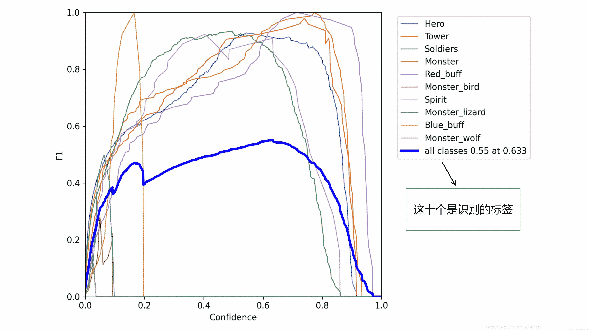

## 4.初步测试：detect.py

下载完yolov5后，什么都不用改，运行**detect.py**

这个是帮你检测能不能正常运行的

若正常：


在runs/detect/exp中能发现被处理过的标签，说明成功了！若程序报错，大概率是因为有的库版本不正确或者还未安装，这个自己调试一下即可，应该没有太大难度 

# 五、训练集要求及路径要求

训练集至少**100张**起步才有效果。要想效果好，用公开的数据集，几千张才会有较好的效果。

训练集就是你需要train并用于detect的东西，我以王者荣耀作为例子，你可以跟着我来一遍，资源在文末。要做自己的训练集的话再看第五步。跟着我的话可以不用做标签，因为资源中已经做好了

如下图所示创建文件夹，让操作更清晰方便

、

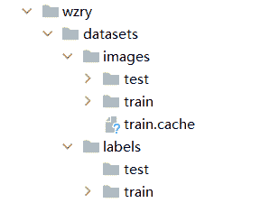


images是图片，labels是标签，train的话是用于训练的，test就是用于测试的，这里**一定一定要照着我的格式去建文件夹**（wzry指王者荣耀，这个可以改成你们的数据集的名字，但是其余的一定要一样），**不然后面训练会出现找不到文件的报错**

# 六、制作自己的数据集之制作标签

可采用labelme和labelimg，前者需要**json**标注格式转txt，后者需要**xml**标注格式转txt。我只用过前者，只给出前者的用法。

## 1.下载labelme

[https://github.com/wkentaro/labelme](https://github.com/wkentaro/labelme "https://github.com/wkentaro/labelme")，如果下载得慢的话见文末资源

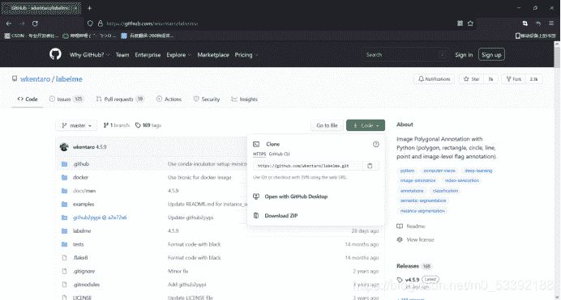

点Download Zip，下载后找到该文件，解压，无需配置环境变量 

## 2.安装依赖库

在Anaconda Prompt里pip install pyqt5和pip install labelme

## 3.labelme操作

然后在Anaconda Prompt里输入labelme，打开界面如下

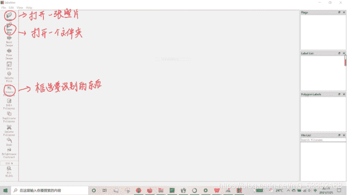

 可以选择打开一个文件或者文件夹，如果是打开文件夹的话就会是下面那样子

右击，点击rectangle，即画矩形框，框选你要识别训练的东西，举王者荣耀的例子


 框选之后输入标签的名字，注意，可以框选多个作为标签。框选完一张图后保存，然后接着下一张图。保存的文件格式是.json

##  4.json转txt

由于**yolov5只认txt而不认json，因此还要有一个转换的过程**

在yolov5-master中创建一个.py文件，代码如下

```
import json
import os

name2id =  {'hero':0,'sodier':1,'tower':2}#标签名称

def convert(img_size, box):
    dw = 1\. / (img_size[0])
    dh = 1\. / (img_size[1])
    x = (box[0] + box[2]) / 2.0 - 1
    y = (box[1] + box[3]) / 2.0 - 1
    w = box[2] - box[0]
    h = box[3] - box[1]
    x = x * dw
    w = w * dw
    y = y * dh
    h = h * dh
    return (x, y, w, h)

def decode_json(json_floder_path, json_name):
    txt_name = 'C:\\Users\\86189\\Desktop\\' + json_name[0:-5] + '.txt'
    #存放txt的绝对路径
    txt_file = open(txt_name, 'w')

    json_path = os.path.join(json_floder_path, json_name)
    data = json.load(open(json_path, 'r', encoding='gb2312',errors='ignore'))

    img_w = data['imageWidth']
    img_h = data['imageHeight']

    for i in data['shapes']:

        label_name = i['label']
        if (i['shape_type'] == 'rectangle'):
            x1 = int(i['points'][0][0])
            y1 = int(i['points'][0][1])
            x2 = int(i['points'][1][0])
            y2 = int(i['points'][1][1])

            bb = (x1, y1, x2, y2)
            bbox = convert((img_w, img_h), bb)
            txt_file.write(str(name2id[label_name]) + " " + " ".join([str(a) for a in bbox]) + '\n')

if __name__ == "__main__":

    json_floder_path = 'C:\\Users\\86189\\Desktop\\哈哈哈\\'
    #存放json的文件夹的绝对路径
    json_names = os.listdir(json_floder_path)
    for json_name in json_names:
        decode_json(json_floder_path, json_name) 
```

标注地方是需要修改的，有几个标签名就写几个标签名，而且这是一个文件夹里所有的json一起转化，存放txt的路径改为labels的train中（还记得下面这张图吗）

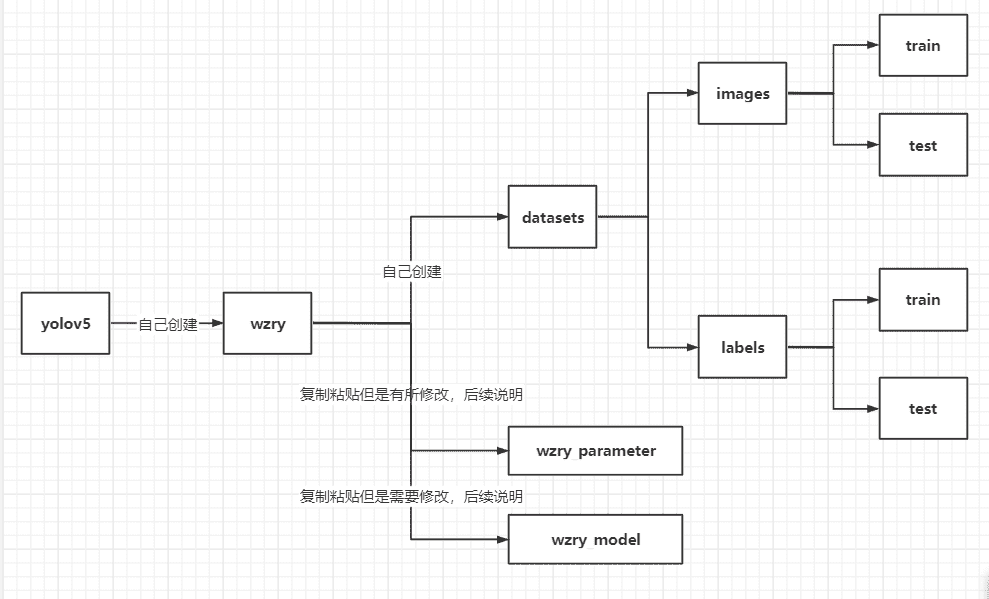

 转化完后大概会是这样子，如果一张图有多个标签的话，这个数据就会变多


简单说明一下，第一个数字是数据集中第0个种类，其余均是与坐标相关的值，软件生成，可不用管。 

##  5.xml转txt

如果使用别的打标签文件或者是原先已经打好的xml文件标签，那么我也给出相关的转换代码

```
import xml.etree.ElementTree as ET
import pickle
import os
from os import listdir, getcwd
from os.path import join

def convert(size, box):
    # size=(width, height)  b=(xmin, xmax, ymin, ymax)
    # x_center = (xmax+xmin)/2        y_center = (ymax+ymin)/2
    # x = x_center / width            y = y_center / height
    # w = (xmax-xmin) / width         h = (ymax-ymin) / height

    x_center = (box[0] + box[1]) / 2.0
    y_center = (box[2] + box[3]) / 2.0
    x = x_center / size[0]
    y = y_center / size[1]

    w = (box[1] - box[0]) / size[0]
    h = (box[3] - box[2]) / size[1]

    # print(x, y, w, h)
    return (x, y, w, h)

def convert_annotation(xml_files_path, save_txt_files_path, classes):
    xml_files = os.listdir(xml_files_path)
    # print(xml_files)
    for xml_name in xml_files:
        # print(xml_name)
        xml_file = os.path.join(xml_files_path, xml_name)
        out_txt_path = os.path.join(save_txt_files_path, xml_name.split('.')[0] + '.txt')
        out_txt_f = open(out_txt_path, 'w')
        tree = ET.parse(xml_file)
        root = tree.getroot()
        size = root.find('size')
        w = int(size.find('width').text)
        h = int(size.find('height').text)

        for obj in root.iter('object'):
            difficult = obj.find('difficult').text
            cls = obj.find('name').text
            # if cls not in classes or int(difficult) == 1:
            #     continue
            cls_id = classes.index(cls)
            xmlbox = obj.find('bndbox')
            b = (float(xmlbox.find('xmin').text), float(xmlbox.find('xmax').text), float(xmlbox.find('ymin').text),
                 float(xmlbox.find('ymax').text))
            # b=(xmin, xmax, ymin, ymax)
            # print(w, h, b)
            bb = convert((w, h), b)
            out_txt_f.write(str(cls_id) + " " + " ".join([str(a) for a in bb]) + '\n')

if __name__ == "__main__":
    # 把forklift_pallet的voc的xml标签文件转化为yolo的txt标签文件
    # 1、需要转化的类别
    classes = ['People', 'Car', 'Bus', 'Motorcycle', 'Lamp', 'Truck']
    # 2、voc格式的xml标签文件路径
    xml_files1 = r'D:\Technology\Python_File\yolov5\M3FD\Annotation_xml'
    # xml_files1 = r'C:/Users/GuoQiang/Desktop/数据集/标签1'

    # 3、转化为yolo格式的txt标签文件存储路径
    save_txt_files1 = r'D:\Technology\Python_File\yolov5\M3FD\Annotation_txt'

    convert_annotation(xml_files1, save_txt_files1, classes) 
```

# 七、修改配置文件

## 1.coco128.yaml->wzry_parameter.yaml

在**yolov5/data/coco128.yaml**中先复制一份，粘贴到wzry中，改名为**wzry_parameter.yaml（意义为wzry的参数配置）**

wzry_parameter.yaml文件需要修改的参数是nc与names。nc是标签名个数，names就是标签的名字，王者荣耀的例子中有10个标签，标签名字都如下。

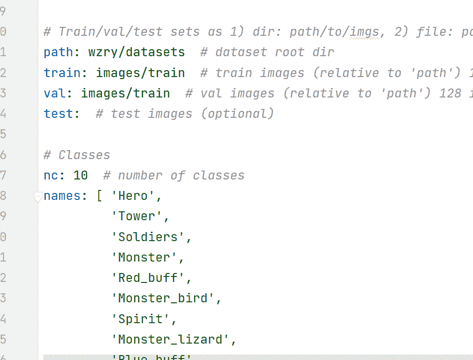

说明：

path是绝对路径

train是在path绝对路径条件下的**训练集**路径，即：wzry/datasets/images/train

val同上，但是是**验证集**，这里我为了方便，让训练集和验证集是一个，也没啥大问题。

test可不填

关于训练集、验证集、测试集三者关系，如下：

[(191条消息) 如何正确使用机器学习中的训练集、验证集和测试集？_nkwshuyi的博客-CSDN博客https://blog.csdn.net/nkwshuyi/article/details/94593053](https://blog.csdn.net/nkwshuyi/article/details/94593053 "(191条消息) 如何正确使用机器学习中的训练集、验证集和测试集？_nkwshuyi的博客-CSDN博客")nc是训练集中种类的个数，names是他们对应的名字，这个顺序不要混了，尤其是自己打标签时，会有对应的顺序的。

## 2.yolov5x.yaml->wzry_model.yaml

yolov5有4种配置，不同配置的特性如下，我这里选择yolov5x，效果较好，但是训练时间长，也比较吃显存


在**yolov5/models**先复制一份yolov5x.yaml至wzry，更名为**wzry_model.yaml**（意为模型），只将如下的nc修改为训练集种类即可

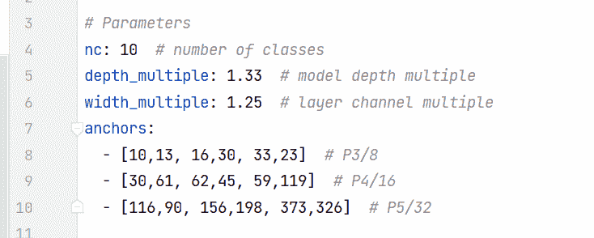

# 八、开始训练train

## 1.调参

在train.py，找到def parse_opt(known=False)这行，这下面是我们要修改的程序部分


我标注“**修改处**”的，是**一定要修改的**；其他的注释是一些较为重要的参数，对于小白而言不改也可。具体修改的地方为**defalut**后

479行：是我们训练的**初始权重**的位置，是以.pt结尾的文件，第一次训练用别人已经训练出来的权重。可能有朋友会想，自己训练的数据集和别人训练的数据集不一样，怎么能通用呢？实际上他们是通用的，后面训练会调整过来。而如果不填已有权重，那么训练效果可能会不好；

480行：**训练模型文件**，在本项目中对应wzry_model.yaml；

481行：**数据集参数文件**，在本项目中对于wzry_parameter.yaml；

482行：**超参数设置**，是人为设定的参数。包括学习率啥的等等，可不改；

483行：**训练轮数**，决定了训练时间与训练效果。如果选择训练模型是yolov5x.yaml，那么大约200轮数值就稳定下来了（收敛）；

484行：**批量处理文件数**，这个要设置地小一些，否则会out of memory。这个决定了我们训练的速度；

485行：**图片大小**，虽然我们训练集的图片是已经固定下来了，但是传入神经网络时可以resize大小，太大了训练时间会很长，且有可能报错，这个根据自己情况调小一些；

487行：**断续训练**，如果说在训练过程中意外地中断，那么下一次可以在这里填True，会接着上一次runs/exp继续训练

496行：**GPU加速**，填0是电脑默认的CUDA，前提是电脑已经安装了CUDA才能GPU加速训练，安装过程可查博客

501行：**多线程设置**，越大读取数据越快，但是太大了也会报错，因此也要根据自己状况填小。

## 2.结果

运行效果正确的应该是这个样子：

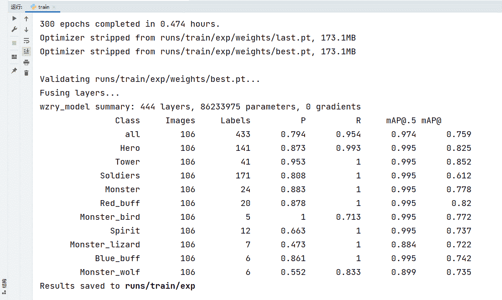

结果保存在runs/train/exp中，多次训练就会有exp1、exp2、等等

best.pt和last.pt是我们训练出来的**权重文件**，比较重要，用于detect.py。last是最后一次的训练结果，best是效果最好的训练结果（只是看起来，但是泛化性不一定强）。

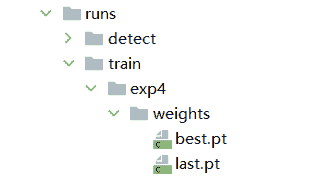

# 九、识别检测detect.py

## 1.调参

找到def parse_opt():这行，以下是我们要调参的位置


217行：填我们训练好的权重文件路径

218行：我们要检测的文件，可以是图片、视频、摄像头。填0时为打开电脑默认摄像头

219行：**数据集参数文件**，同上

220行：**图片大小**，同上

221行：置信度，当检测出来的置信度大于该数值时才能显示出被检测到，就是显示出来的**框框**

222行：非极大抑制，具体不赘述了，自行查阅，可不改

224行：**GPU加速**，同上

##  2.结果

结果在runs/detect/exp中

# 十、debug

我猜测大多数问题为：

1.**xxx not found**，明明自己做了标签但是没找到。那很有可能是你的文件路径没照着我去做。细心的朋友发现了，在wzry_parameter时只填了训练集的图片，没填标签，那它能检测到标签吗？可以检测到，是因为**文件夹命名的原因，标签文件夹命名为labels就可**。

2.**显卡爆了**，那就调低train中我列出来的那几行**default**

3.有朋友说他在训练时，**box obj cls labels的值为0或nan**。正常情况下是正常的数（我发了训练的时候的图片），我猜测可能是**训练集标签没做好（数据集中存在标注错误的东西、训练难度大）** 或者 **路径没写对** 或者 **超参数** 没调好

4.**路径不要带中文**，建议**改成全英文**，否则可能会出现意料之外的错误

5.**pycharm闪退**，很有可能是因为你电脑out of memory了，电脑寄了，**调小batch size和workers**。

6.**index 9 is out of bounds for axis 1 with size 2**之类的问题，可能是标签txt文件里的种类数字超过了在yaml配置文件中nc与names未配置好，标签文件与配置文件的classes未配对上。因此，**txt标签文件与配置文件都要仔细检查一下**。

7.**No labels found**之类的问题，1：要将数据集标签格式转化为**txt格式**，2：要将**数据集的目录名字**改成我写出来的那样，尤其是images和labels。

# 十一、如果自己电脑算力不够怎么办？

采用云服务器，具体见我的另一篇博客

[使用恒源云服务器跑深度学习（使用pycharm_professional，FileZilla，xshell）](https://blog.csdn.net/m0_53392188/article/details/124339442 "使用恒源云服务器跑深度学习（使用pycharm_professional，FileZilla，xshell）")

# 十二、是否可以部署至树莓派？

我之前用yolov5x.yaml作网络，根本跑不动，三秒一帧。

在B站上有很多演示，如果部署会非常卡，就算部署，也是采用最轻量级的yolov5s.yaml。

目前我正在做这个事，最好的解决方法是采用darknet框架的yolo-fastest，fps能达到10。后续我会写一个教程

# 十三、百度网盘资源

链接：https://pan.baidu.com/s/10yOdyRjVBLF8rZPghE_5OA 
提取码：mvpx 

# 十四、结语

*   我也是个小白，可能存在很多不足之处，希望有不足之处可以包容，我会改正的(⸝⸝•‧̫•⸝⸝)
*   最后感谢我的hxd，很多都是他教的，我自己尝试过一遍并且成功了，整理排版才的来这篇文章
*   如果遇到出现错误的，自己先多找一找问题，能力在debug中会不断提高的

你们的每个赞都能让我开心好几天✿✿ヽ(°▽°)ノ✿