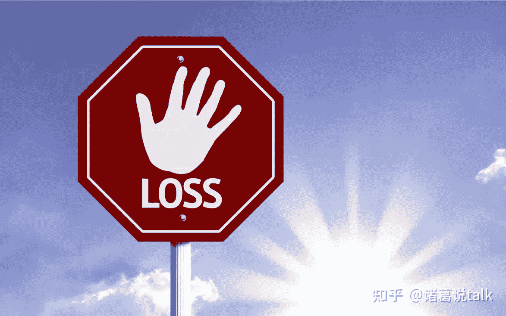

<!--yml
category: 交易
date: 2023-09-17 20:12:03
-->

# 一文读懂常见订单类型及backtrader支持情况 - 知乎

> 来源：[https://zhuanlan.zhihu.com/p/586998473](https://zhuanlan.zhihu.com/p/586998473)



## **简介**

订单反映的是投资者的决策，表明投资者想以什么价格买入/卖出对应的投资标的，订单价格对最后的投资结果影响非常大，懂得都懂。

投资者常用的订单类型包括市价单、限价单、止损/止盈单、移动止损/止盈单、附加订单等，然而交易所却只有市价单和限价单两种基本订单类型，其他的订单类型则是由券商的系统提供的。 券商的软件系统会帮助监控价格，达到触发条件后就转为市价单和限价单下发给交易所执行。

Backtrader 支持多种交易订单类型，用以满足不同的交易需求，投资者常用的几种订单类型backtrader基本都支持。backtrader通过调用Strategy的buy()、sell()、close()方法来创建订单。

## **常见订单类型**

### **1\. 市价单（Market）**

市价单指以市场价格买进或卖出的委托单，不需要自己设定价格

*   优点：保证立即达成交易，防止踏空或尽快止盈/止损
*   缺点：无法准确控制成交价格。当市场快速变化或流动性不足时，成交价格与下单时的价格可能相差很远，也就是滑点很大
*   backtrader Order.Market类型**：** 按下一个 Bar 的开盘价来执行成交。 使用示例： self.buy(exectype=bt.Order.Market)，backtrader默认是市价单
*   backtrader Order.Close类型**：**按下一个 Bar 的收盘价来执行成交。 使用示例： self.buy(exectype=bt.Order.Close)

### **2\. 限价单（Limit）**

限价单指的是只有达到指定价格（limit Price）或有更好价格时才会执行委托单，即以指定价或低于指点价买入，以指点价或更高指定价卖出

*   优点：能明确知道成交价格
*   缺点：无法保证成交速度，可能无法成交
*   backtrader Order.Limit类型**：**在订单生成后，通过比较 limit Price 与之后 Bar 的 open/high/low/close 行情数据来判断订单是否成交。如果下一个 Bar 的 open 触及到指定价格 limit Price，则订单在这个 Bar 的开始时以 open 价成交；如果下一个 Bar 的 open 未触及限价，但限价位于这个 bar 的high/low价格之间，就以 limit Price 成交。如果仍然不在范围内，则继续检测之后的Bar。使用示例：self.buy(exectype=bt.Order.Limit, price=price, valid=valid) 。其中valid表示订单有效期，可选取值有：None 表示订单在完成成交或被撤销之前一直都有效； datetime实例、date 实例、数值形式的日期，表示订单在设置的 date 之前有效；Order.DAY 、0 、imedelta()，表示订单当日有效

## **3\. 市价止盈/止损单（Stop）**

市价止盈/止损单指的是当最新价达到设定的止盈/止损价格（Stop Price）时，将以**市价单**形式下单

*   优点：在价格到达止盈/止损点后立即以市价单下单
*   缺点：无法准确控制成交价
*   backtrader Order.Stop类型**：**通过比较 Stop Price 与之后 Bar 的 open/high/low/close 行情数据来判断订单是否成交。如果下一个 Bar 的 open 触及到指定价格 limit Price，则订单在这个 Bar 的开始时以 open 价成交；如果下一个 Bar 的 open 未触及限价，但限价位于这个 bar 的high/low价格之间，就以 stop Price 成交。 使用示例：self.buy(exectype=bt.Order.Stop, price=price, valid=valid)

## **4.** **限价止盈/止损单（Stop-Limit)**

限价止盈/止损单指的是一旦股价达到设置的止损价格，将以限价单的方式下单，需要指定止损价格和限价

*   优点：在价格到达止盈/止损点后提交限价单，能准确知道成交价格
*   缺点：无法保证成交速度，可能无法成交
*   backtrader Order.StopLimit类型**：**在下一个 Bar，按 Order.Stop 的逻辑触发订单，然后以 Order.Limit 的逻辑执行订单。使用示例：self.buy(exectype=bt.Order.StopLimit, price=price, valid=valid, plimit=plimit)

## **5.** **移动止损单（Stop-Trailing）**

移动止损单是一种止损价格会自动调整的止损单，调整范围通过设置止损价格和市场价格之间的差价来确定在市场价格上升时，止损价格会随之上升；若股价触及止损价格时，会以市价单的形式执行订单；若市场价格下降或保持不变，止损价格会保持不变

*   优点：通过移动止盈/止损，提前锁定利润或者防止亏损扩大
*   缺点：差价太小，很容易被波动震出，只能吃到很小一部分利润；差价太大，则起不到移动止盈/止损的效果
*   backtrader Order.StopTrail类型**：**使用示例：self.buy(exectype=bt.Order.StopTrail, price=xxx, trailamount=xxx)，差价即可以用金额 trailamount 表示，也可以用市价的百分比 trailpercent 表示
*   backtrader Order.StopTrailLimit类型**：**跟踪止损限价单，是一种止损价格会自动调整的止损限价单，订单中的限价 Limit Price 不会发生变动，止损价会发生变动。 使用示例：self.buy(exectype=bt.Order.StopTrailLimit, plimit=xxx, trailamount=xxx)

## **6.** **附加订单**

附加订单是指附加在一笔普通的开仓订单之上用户平仓的订单，附加订单会在父订单完全成交并达到触发价格之后提交，帮主订单起到止盈或止损效果，最终完成平仓。附加订单类型有止盈单、止损单、括号订单、关联取消订单等

*   止盈单是一笔特殊的限价单，其代码、数量与父订单一致，方向与父订单相反，订单价格为止盈价。在父订单完全成交后，达到了止盈价的止盈单将被提交
*   止损单是一笔特殊的止损市价单，其代码和数量与父订单一致，方向与父订单相反，订单触发价为止损价。在父订单完全成交后，达到了止损价的止损单将被提交

### **6.1 括号订单（Bracket）**

括号单由一笔止盈单和一笔止损单共同组成。在父订单完全成交后，先达到触发价的订单会被提交，另外一笔订单将被系统自动撤单。 当分别设置止盈和止损订单时，它们是“相互独立”的，譬如触发了止损，止盈单不会自动取消，需要手动取消

*   想要创建会“自动取消”的止盈止损单，一种是下主定单（建仓/开仓）时，同时添加上“括号定单（附加定单）”，主定单未成交则附加定单不激活，主定单成交后，附加订单处于激活状态
*   括号定单可以同时设止盈和止损，触发了止盈后，止损单会自动取消
*   无论是市价主订单附加止盈止损订单还是限价主订单附加止盈止损订单，都可以在市价母定单在传递到交易所之前，设置好止盈止损括号单。如果忘记了添加，只要限价单未成交(市价单会马上成交)，都可以继续添加上括号单，成交之后就不能添加括号单了
*   backtrader在Strategy类中提供了2种方法来操作括号订单：`buy_bracket` and `sell_bracket`

### **6.2** **关联取消订单(One Cancel Others)**

OCO指的是一个订单的执行、取消或到期，会自动取消其他相关联的订单。backtrader的buy函数参数`oco`用来指定oco 订单组

```
def next(self):
    ...
    o1 = self.buy(...)
    ...
    o2 = self.buy(..., oco=o1)
    ...
    o3 = self.buy(..., oco=o1) 
```

上面代码形成一个oco订单组，其中o1是组长。组中任何一个订单的执行、取消或到期，都会自动取消组中其他相关联的订单

### **6.3** **一取消全（One-Cancels-All）**

OCA指的是客户下达多个等待成交的订单，并对它们进行编组，只要这一组中有一个订单成交，则其他订单立即全部取消。其实括号订单、OCO也属于一取消全订单

## **结论&交流**

关注微信公众号：诸葛说talk，获取更多内容。同时还能获取邀请加入量化投资研讨群， 与众多从业者、技术大牛一起交流、切磋，名额有限，不要错过。

写文章不易，觉得本文对你有帮助的话，帮忙点赞转发赞赏，让笔者有坚持写好文章的动力。

## **参考**