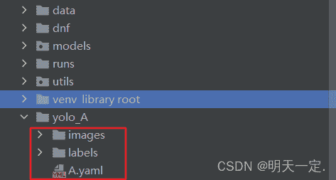
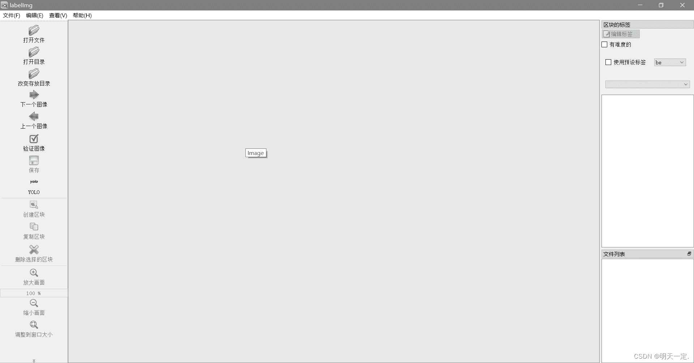
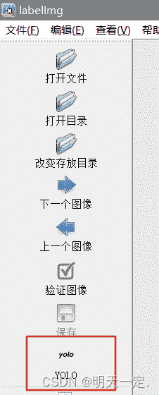
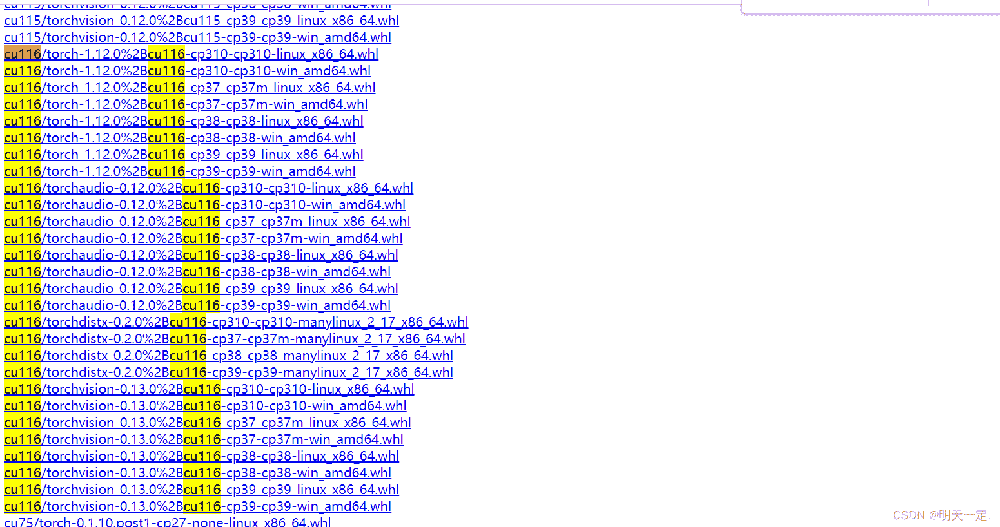

<!--yml
category: 游戏
date: 2023-02-28 15:59:47
-->

# 图像识别从零写出dnf脚本关键要点_yolo dnf_明天一定.的博客-CSDN博客

> 来源：[https://blog.csdn.net/wai_58934/article/details/126090670](https://blog.csdn.net/wai_58934/article/details/126090670)

# 思路：

1.  知道游戏角色在哪个坐标
2.  知道怪物和门在哪个坐标
3.  驱动级键鼠操作让角色走到怪物坐标然后攻击释放技能。

满足第一和第二条就要求必须实时读入图像以及能够识别标志性图像然后给出坐标。

# 实时读入图像

没精力玩python了，还是好好学Java吧

废话不多说直接上代码

```
import cv2
from PIL import ImageGrab
import numpy as np

while True:
    im = ImageGrab.grab()
    imm = cv2.cvtColor(np.array(im), cv2.COLOR_RGB2BGR)
    imm = imm[0:500, 0:500]
    imm = cv2.resize(imm, None, fx=0.5, fy=0.5)
    cv2.imshow("capture", imm)
    if cv2.waitKey(1) & 0xFF == ord('q'):  # q键推出
        break
cv2.destroyAllWindows()
```

# 图像识别

我使用的是yolov5。

python版本是：3.10.5

前边简单说一下吧，省的以后我用了再忘记了

## 前置工作

1.  用pycharm创建虚拟环境
2.  在github把项目克隆下来[GitHub - ultralytics/yolov5: YOLOv5 🚀 in PyTorch > ONNX > CoreML > TFLite](https://github.com/ultralytics/yolov5 "GitHub - ultralytics/yolov5: YOLOv5 🚀 in PyTorch > ONNX > CoreML > TFLite")
3.  下载依赖（项目里的requirements.txt）：pip install -r requirements.txt
4.  在克隆下载的目录级创建这样一个目录，其实创建在哪都无所谓，就是方便（作用就是放图片，放标签，放配置）
5.  开始截图（把截下来的图都放在images里）
6.  开始标注（这里我用的是labelImg）
7.  训练
8.  预测

## 6.标注

python版本：3.7.8（高版本可能不兼容，但我忘记哪里不兼容了，降低就对了）

从github下载克隆[GitHub - heartexlabs/labelImg: 🖍️ LabelImg is a graphical image annotation tool and label object bounding boxes in images](https://github.com/heartexlabs/labelImg "GitHub - heartexlabs/labelImg: 🖍️ LabelImg is a graphical image annotation tool and label object bounding boxes in images")

 安装：**pip install PyQt5**

安装：**pip install lxml**

进入克隆目录执行：**pyrcc5 -o resources.py resources.qrc**

把resource.py放入libs目录

执行：python labelImg.py 后启动窗口



 我们直接打开目录（指的是你的图片存放目录），然后指定改变存放目录（指的是你的label目录），重要的是：别忘了改为yolo。标注技巧：w是标注，d是下一张

 

 然后现在你的

 这个目录应该是有东西的（除了yaml文件还没写）

## 7.训练

多么痛的领悟，我用我电脑训练了一天也没训练完。

我选择使用 colab去训练（需要谷歌账号，需要翻墙）

> Colaboratory 简称“Colab”，Google Research 团队开发，任何人都可以通过浏览器编写和执行任意 Python 代码，尤其适合机器学习、数据分析、教育目的。Colab 是一种托管式 Jupyter 笔记本服务，用户无需设置，就可直接使用，还能免费使用 GPU/TPU计算资源。

 我账号异常了，没办法截图细说了：[Colaboratory（ 简称"Colab"）介绍与使用 - 知乎](https://zhuanlan.zhihu.com/p/302864983 "Colaboratory（ 简称"Colab"）介绍与使用 - 知乎")

简单来说就是创建 Colaboratory，然后挂载文件，把yolo_A打包放上去，然后在上边解压缩

，搭建yolov5环境，选择GPU之后，可以像在本地一样训练模型。

 训练的时候需要用到上边的A.yaml.案例写法

> ```
> # train and val data as 1) directory: path/images/, 2) file: path/images.txt, or 3) list: [path1/images/, path2/images/]
> train: ../yolo_A/images/
> val: ../yolo_A/images/
> # number of classes 类型的数量，几个类型名字就填几
> nc: 1
> 
> # class names 类型的名字，可以有多个
> names: ['be']
> ```

 训练模型代码实例：yolov5s.pt可以在[Releases · ultralytics/yolov5 · GitHub](https://github.com/ultralytics/yolov5/releases "Releases · ultralytics/yolov5 · GitHub")找到并下载

> python train.py --img 640 --batch 54 --epochs 100 --data A.yaml --weights yolov5s.pt --nosave --cache

训练完的文件我们需要best.pt，在yolov5-master\runs\train里边。直接拿到本地使用。

## 8.预测

因为我需要拿到预测后的结果，以及我传进去的是cv2.imread()后的numpy数组，所以我对detect源码文件的run函数做了精简和修改。修改后的文件比较冗余，因为我只是玩玩，所以就没浪费时间整理代码，大家参考即可。新增的imMy参数就是传入的数组，source没啥用，但是你得传入一个本地存在的图片路径（这个冗余，没修改）

```
# YOLOv5 🚀 by Ultralytics, GPL-3.0 license
"""
Run inference on images, videos, directories, streams, etc.

Usage - sources:
    $ python path/to/detect.py --weights yolov5s.pt --source 0              # webcam
                                                             img.jpg        # image
                                                             vid.mp4        # video
                                                             path/          # directory
                                                             path/*.jpg     # glob
                                                             'https://youtu.be/Zgi9g1ksQHc'  # YouTube
                                                             'rtsp://example.com/media.mp4'  # RTSP, RTMP, HTTP stream

Usage - formats:
    $ python path/to/detect.py --weights yolov5s.pt                 # PyTorch
                                         yolov5s.torchscript        # TorchScript
                                         yolov5s.onnx               # ONNX Runtime or OpenCV DNN with --dnn
                                         yolov5s.xml                # OpenVINO
                                         yolov5s.engine             # TensorRT
                                         yolov5s.mlmodel            # CoreML (macOS-only)
                                         yolov5s_saved_model        # TensorFlow SavedModel
                                         yolov5s.pb                 # TensorFlow GraphDef
                                         yolov5s.tflite             # TensorFlow Lite
                                         yolov5s_edgetpu.tflite     # TensorFlow Edge TPU
"""

import argparse
import os
import platform
import sys
from pathlib import Path
import numpy as np
import torch
import torch.backends.cudnn as cudnn

from utils.augmentations import letterbox

FILE = Path(__file__).resolve()
ROOT = FILE.parents[0]  # YOLOv5 root directory
if str(ROOT) not in sys.path:
    sys.path.append(str(ROOT))  # add ROOT to PATH
ROOT = Path(os.path.relpath(ROOT, Path.cwd()))  # relative

from models.common import DetectMultiBackend
from utils.dataloaders import IMG_FORMATS, VID_FORMATS, LoadImages, LoadStreams
from utils.general import (LOGGER, check_file, check_img_size, check_imshow, check_requirements, colorstr, cv2,
                           increment_path, non_max_suppression, print_args, scale_coords, strip_optimizer, xyxy2xywh)
from utils.plots import Annotator, colors, save_one_box
from utils.torch_utils import select_device, time_sync

@torch.no_grad()
def run(
        imMy = None,
        weights=ROOT / 'yolov5s.pt',  # model.pt path(s)
        source=ROOT / 'data/images',  # file/dir/URL/glob, 0 for webcam
        data=ROOT / 'data/coco128.yaml',  # dataset.yaml path
        imgsz=(640, 640),  # inference size (height, width)
        conf_thres=0.25,  # confidence threshold
        iou_thres=0.45,  # NMS IOU threshold
        max_det=1000,  # maximum detections per image
        device='',  # cuda device, i.e. 0 or 0,1,2,3 or cpu
        classes=None,  # filter by class: --class 0, or --class 0 2 3
        agnostic_nms=False,  # class-agnostic NMS
        augment=False,  # augmented inference
        visualize=False,  # visualize features
        hide_labels=False,  # hide labels
        hide_conf=False,  # hide confidences
        half=False,  # use FP16 half-precision inference
        dnn=False,  # use OpenCV DNN for ONNX inference
):
    source = str(source)
    # Load model
    device = select_device(device)
    print(device)
    model = DetectMultiBackend(weights, device=device, dnn=dnn, data=data, fp16=half)
    stride, names, pt = model.stride, model.names, model.pt
    imgsz = check_img_size(imgsz, s=stride)  # check image size

    dataset = LoadImages(source, img_size=imgsz, stride=stride, auto=pt)
    bs = 1  # batch_size

    # Run inference
    model.warmup(imgsz=(1 if pt else bs, 3, *imgsz))  # warmup

    for path, im, im0s, vid_cap, s in dataset:
        im0s = imMy
        # Padded resize
        img = letterbox(im0s, (800,608), stride=32, auto=True)[0]
        # Convert
        img = img.transpose((2, 0, 1))[::-1]  # HWC to CHW, BGR to RGB
        img = np.ascontiguousarray(img)
        im = img

        im = torch.from_numpy(im).to(device)
        im = im.half() if model.fp16 else im.float()  # uint8 to fp16/32
        im /= 255  # 0 - 255 to 0.0 - 1.0
        if len(im.shape) == 3:
            im = im[None]  # expand for batch dim

        # Inference
        visualize = increment_path(save_dir / Path(path).stem, mkdir=True) if visualize else False
        pred = model(im, augment=augment, visualize=visualize)
        # pred = model(im, augment=augment, visualize=False)

        # NMS
        pred = non_max_suppression(pred, conf_thres, iou_thres, classes, agnostic_nms, max_det=max_det)

        # Second-stage classifier (optional)
        # pred = utils.general.apply_classifier(pred, classifier_model, im, im0s)
        # Process predictions
        res = []
        for i, det in enumerate(pred):  # per image
            im0 = im0s.copy()

            if len(det):
                # Rescale boxes from img_size to im0 size
                det[:, :4] = scale_coords(im.shape[2:], det[:, :4], im0.shape).round()

                # Write results
                for *xyxy, conf, cls in reversed(det):
                    parm = []
                    c = int(cls)

                    label = None if hide_labels else (names[c] if hide_conf else f'{names[c]} {conf:.2f}')
                    p1, p2 = (int(xyxy[0]), int(xyxy[1])), (int(xyxy[2]), int(xyxy[3]))
                    parm.append(label)
                    parm.append(p1)
                    parm.append(p2)
                    res.append(parm)

        return res

def parse_opt():
    parser = argparse.ArgumentParser()
    parser.add_argument('--weights', nargs='+', type=str, default=ROOT / 'yolov5s.pt', help='model path(s)')
    parser.add_argument('--source', type=str, default=ROOT / 'data/images', help='file/dir/URL/glob, 0 for webcam')
    parser.add_argument('--data', type=str, default=ROOT / 'data/coco128.yaml', help='(optional) dataset.yaml path')
    parser.add_argument('--imgsz', '--img', '--img-size', nargs='+', type=int, default=[640], help='inference size h,w')
    parser.add_argument('--conf-thres', type=float, default=0.25, help='confidence threshold')
    parser.add_argument('--iou-thres', type=float, default=0.45, help='NMS IoU threshold')
    parser.add_argument('--max-det', type=int, default=1000, help='maximum detections per image')
    parser.add_argument('--device', default='', help='cuda device, i.e. 0 or 0,1,2,3 or cpu')
    parser.add_argument('--view-img', action='store_true', help='show results')
    parser.add_argument('--save-txt', action='store_true', help='save results to *.txt')
    parser.add_argument('--save-conf', action='store_true', help='save confidences in --save-txt labels')
    parser.add_argument('--save-crop', action='store_true', help='save cropped prediction boxes')
    parser.add_argument('--nosave', action='store_true', help='do not save images/videos')
    parser.add_argument('--classes', nargs='+', type=int, help='filter by class: --classes 0, or --classes 0 2 3')
    parser.add_argument('--agnostic-nms', action='store_true', help='class-agnostic NMS')
    parser.add_argument('--augment', action='store_true', help='augmented inference')
    parser.add_argument('--visualize', action='store_true', help='visualize features')
    parser.add_argument('--update', action='store_true', help='update all models')
    parser.add_argument('--project', default=ROOT / 'runs/detect', help='save results to project/name')
    parser.add_argument('--name', default='exp', help='save results to project/name')
    parser.add_argument('--exist-ok', action='store_true', help='existing project/name ok, do not increment')
    parser.add_argument('--line-thickness', default=3, type=int, help='bounding box thickness (pixels)')
    parser.add_argument('--hide-labels', default=False, action='store_true', help='hide labels')
    parser.add_argument('--hide-conf', default=False, action='store_true', help='hide confidences')
    parser.add_argument('--half', action='store_true', help='use FP16 half-precision inference')
    parser.add_argument('--dnn', action='store_true', help='use OpenCV DNN for ONNX inference')
    opt = parser.parse_args()
    opt.imgsz *= 2 if len(opt.imgsz) == 1 else 1  # expand
    print_args(vars(opt))
    return opt

def main(opt):
    check_requirements(exclude=('tensorboard', 'thop'))
    run(**vars(opt))

if __name__ == "__main__":
    opt = parse_opt()
    main(opt) 
```

使用：

```
res = detect.run(weights='./dnf/best.pt',source="yolo_A/images/2a.jpg",data="yolo_A/A.yaml",imgsz=(800, 608),
                 imMy=imm)
```

 这样，结合前边实时捕获桌面，就可以实现大部分的功能了。

## 基于gpu预测

最后我嫌弃预测太慢，想指定GPU预测，但是发现一直false

> ```
> print(torch.cuda.is_available())  // False
> ```

 然后我安装了cuda，参考：[CUDA安装教程（超详细）_Billie使劲学的博客-CSDN博客_cuda安装](https://blog.csdn.net/m0_45447650/article/details/123704930 "CUDA安装教程（超详细）_Billie使劲学的博客-CSDN博客_cuda安装")

 然后从虚拟环境卸载torch和torchversion（pip uninstall一下即可）

从[Start Locally | PyTorch](https://pytorch.org/get-started/locally/ "Start Locally | PyTorch")找到适合你电脑的版本，以下是我的


 然后从[https://download.pytorch.org/whl/torch_stable.html](https://download.pytorch.org/whl/torch_stable.html "https://download.pytorch.org/whl/torch_stable.html")安装wheel文件



 安装torch和torchvision,具体安装cp多少（我是根据安装yolo环境时pip install -r requirements.txt时控制台打印安装的torch对应的cp）

然后安装wheel文件。

运行发现

> print(torch.cuda.is_available()) // True

 我的版本device指定为空并gpu可用时则选择gpu

完结撒花。

# 驱动级键盘操作绕过游戏检测

查了一堆博客驱动级操作，甚至加群问别人怎么做都没问出来，真。。。

最后试到凌晨，废话不多说直接上正确案例，需要用到pywin32，自己pip一下（运行时需要管理员运行）

```
import time
import win32api
import win32con
import ctypes
import win32gui

VK_CODE = {
    'backspace': 0x08,
    'tab': 0x09,
    'clear': 0x0C,
    'enter': 0x0D,
    'shift': 0x10,
    'ctrl': 0x11,
    'alt': 0x12,
    'pause': 0x13,
    'caps_lock': 0x14,
    'esc': 0x1B,
    'spacebar': 0x20,
    'page_up': 0x21,
    'page_down': 0x22,
    'end': 0x23,
    'home': 0x24,
    'left_arrow': 0x25,
    'up_arrow': 0x26,
    'right_arrow': 0x27,
    'down_arrow': 0x28,
    'select': 0x29,
    'print': 0x2A,
    'execute': 0x2B,
    'print_screen': 0x2C,
    'ins': 0x2D,
    'del': 0x2E,
    'help': 0x2F,
    '0': 0x30,
    '1': 0x31,
    '2': 0x32,
    '3': 0x33,
    '4': 0x34,
    '5': 0x35,
    '6': 0x36,
    '7': 0x37,
    '8': 0x38,
    '9': 0x39,
    'a': 0x41,
    'b': 0x42,
    'c': 0x43,
    'd': 0x44,
    'e': 0x45,
    'f': 0x46,
    'g': 0x47,
    'h': 0x48,
    'i': 0x49,
    'j': 0x4A,
    'k': 0x4B,
    'l': 0x4C,
    'm': 0x4D,
    'n': 0x4E,
    'o': 0x4F,
    'p': 0x50,
    'q': 0x51,
    'r': 0x52,
    's': 0x53,
    't': 0x54,
    'u': 0x55,
    'v': 0x56,
    'w': 0x57,
    'x': 0x58,
    'y': 0x59,
    'z': 0x5A,
    'numpad_0': 0x60,
    'numpad_1': 0x61,
    'numpad_2': 0x62,
    'numpad_3': 0x63,
    'numpad_4': 0x64,
    'numpad_5': 0x65,
    'numpad_6': 0x66,
    'numpad_7': 0x67,
    'numpad_8': 0x68,
    'numpad_9': 0x69,
    'multiply_key': 0x6A,
    'add_key': 0x6B,
    'separator_key': 0x6C,
    'subtract_key': 0x6D,
    'decimal_key': 0x6E,
    'divide_key': 0x6F,
    'F1': 0x70,
    'F2': 0x71,
    'F3': 0x72,
    'F4': 0x73,
    'F5': 0x74,
    'F6': 0x75,
    'F7': 0x76,
    'F8': 0x77,
    'F9': 0x78,
    'F10': 0x79,
    'F11': 0x7A,
    'F12': 0x7B,
    'F13': 0x7C,
    'F14': 0x7D,
    'F15': 0x7E,
    'F16': 0x7F,
    'F17': 0x80,
    'F18': 0x81,
    'F19': 0x82,
    'F20': 0x83,
    'F21': 0x84,
    'F22': 0x85,
    'F23': 0x86,
    'F24': 0x87,
    'num_lock': 0x90,
    'scroll_lock': 0x91,
    'left_shift': 0xA0,
    'right_shift ': 0xA1,
    'left_control': 0xA2,
    'right_control': 0xA3,
    'left_menu': 0xA4,
    'right_menu': 0xA5,
    'browser_back': 0xA6,
    'browser_forward': 0xA7,
    'browser_refresh': 0xA8,
    'browser_stop': 0xA9,
    'browser_search': 0xAA,
    'browser_favorites': 0xAB,
    'browser_start_and_home': 0xAC,
    'volume_mute': 0xAD,
    'volume_Down': 0xAE,
    'volume_up': 0xAF,
    'next_track': 0xB0,
    'previous_track': 0xB1,
    'stop_media': 0xB2,
    'play/pause_media': 0xB3,
    'start_mail': 0xB4,
    'select_media': 0xB5,
    'start_application_1': 0xB6,
    'start_application_2': 0xB7,
    'attn_key': 0xF6,
    'crsel_key': 0xF7,
    'exsel_key': 0xF8,
    'play_key': 0xFA,
    'zoom_key': 0xFB,
    'clear_key': 0xFE,
    '+': 0xBB,
    ',': 0xBC,
    '-': 0xBD,
    '.': 0xBE,
    '/': 0xBF,
    ';': 0xBA,
    '[': 0xDB,
    '\\': 0xDC,
    ']': 0xDD,
    "'": 0xDE,
    '`': 0xC0}

# handle = win32gui.FindWindow(None, '地下城与勇士')
# win32gui.SetForegroundWindow(handle)

while True:
    time.sleep(5)
    MapVirtualKey = ctypes.windll.user32.MapVirtualKeyA
    time.sleep(0.3)
    win32api.keybd_event(VK_CODE["numpad_8"], win32api.MapVirtualKey(VK_CODE["numpad_8"], 0), 0, 0)  # 0
    time.sleep(0.3)
    win32api.keybd_event(VK_CODE["numpad_8"], win32api.MapVirtualKey(VK_CODE["numpad_8"], 0), win32con.KEYEVENTF_KEYUP, 0)
    time.sleep(0.3)
    win32api.keybd_event(VK_CODE["numpad_5"], win32api.MapVirtualKey(VK_CODE["numpad_5"], 0), 0, 0)  # 0
    time.sleep(0.3)
    win32api.keybd_event(VK_CODE["numpad_5"], win32api.MapVirtualKey(VK_CODE["numpad_5"], 0), win32con.KEYEVENTF_KEYUP,
                         0)
    time.sleep(0.3)
    win32api.keybd_event(VK_CODE["numpad_4"], win32api.MapVirtualKey(VK_CODE["numpad_4"], 0), 0, 0)  # 0
    time.sleep(0.3)
    win32api.keybd_event(VK_CODE["numpad_4"], win32api.MapVirtualKey(VK_CODE["numpad_4"], 0), win32con.KEYEVENTF_KEYUP, 0)
    time.sleep(0.3)
    win32api.keybd_event(VK_CODE["numpad_6"], win32api.MapVirtualKey(VK_CODE["numpad_6"], 0), 0, 0)  # 0
    time.sleep(0.3)
    win32api.keybd_event(VK_CODE["numpad_6"], win32api.MapVirtualKey(VK_CODE["numpad_6"], 0), win32con.KEYEVENTF_KEYUP, 0)
    # win32api.keybd_event(0x0D, 0, 0, 0)  # enter
    # win32api.keybd_event(0x0D, 0, win32con.KEYEVENTF_KEYUP, 0) 
```